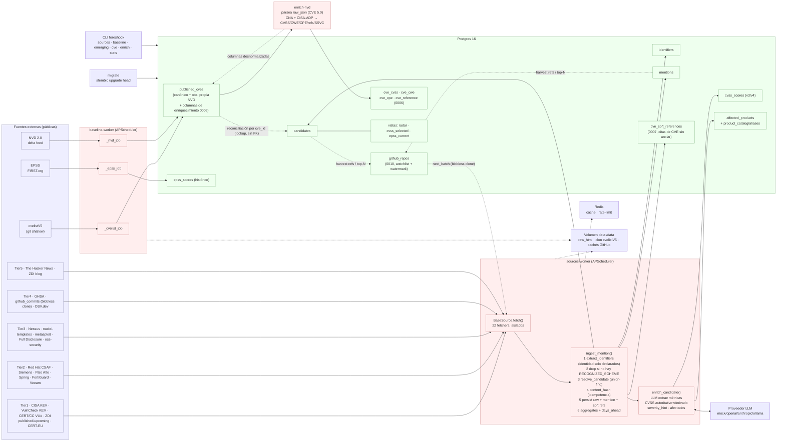

# Arquitectura de Foreshock

Foreshock es un **radar temprano de vulnerabilidades**: un backend de carga de
datos (sin UI) que capta señales de que una vulnerabilidad existe **antes** de
que su CVE esté publicado y analizado en NVD, y mide cuántos días de ventaja
obtiene cada fuente.

Todo el código vive en el paquete `app/` y se ejecuta como procesos Python
sobre Postgres 16 + Redis. No hay servidor web ni frontend.

---

## Diagrama de componentes



Leyenda: **azul** = fuentes externas · **rojo** = procesos/lógica ·
**verde** = almacenamiento. Flechas continuas = flujo de datos; punteadas =
infraestructura de apoyo; la punteada etiquetada = reconciliación blanda por
`cve_id`.

---

## Los tres procesos de `docker-compose.yml`

`docker-compose.yml` levanta infraestructura (`postgres`, `redis`) y tres
procesos de aplicación construidos con la misma imagen (`docker/Dockerfile`):

| Servicio | Comando | Rol |
|---|---|---|
| `migrate` | `alembic upgrade head` | Aplica las migraciones y termina. El resto espera a que acabe con éxito (`service_completed_successfully`). |
| `baseline-worker` | `python -m app.baseline` | Sincroniza el estado canónico (cvelistV5 + delta NVD 2.0 + EPSS) en bucle con APScheduler. |
| `sources-worker` | `python -m app.sources` | Ejecuta los fetchers habilitados en sus cadencias; ingesta menciones y enriquece candidates. |

`migrate` es un job efímero de un solo uso; los dos workers son procesos de
larga duración (`restart: unless-stopped`). Ambos workers y `migrate`
comparten el volumen `data:/data` (HTML crudo, clon de cvelistV5, cachés de
GitHub) y apuntan al mismo `DATABASE_URL`.

- **`app/baseline/__main__.py`** — `AsyncIOScheduler` con tres jobs
  (`_cvelist_job`, `_nvd_job`, `_epss_job`) a las cadencias de `Settings`
  (`cvelist_sync_seconds=900`, `nvd_delta_seconds=7200`,
  `epss_sync_seconds=86400`). Hace una pasada inicial inmediata al arrancar.
- **`app/sources/__main__.py`** — al arrancar llama a `sync_registry_to_db()`
  (registra los fetchers del código en la tabla `sources`) y programa cada
  fuente `enabled` con su `cadence_seconds` (con `jitter=30`,
  `max_instances=1`).

---

## Flujo de datos: fuente → ingesta → candidate → enriquecimiento

```
                 ┌──────────────────── baseline-worker ─────────────────────┐
                 │  cvelistV5 (git shallow)  NVD 2.0 delta   EPSS (FIRST)    │
                 │        │                      │              │            │
                 │        └──────────► published_cves ◄─────────┘            │
                 │            (estado canónico + observación propia NVD)     │
                 └───────────────────────────┬──────────────────────────────┘
                                             │ reconciliación por cve_id (lookup, sin FK)
                                             ▼
 ┌──────────────────── sources-worker ───────────────────────────────────────┐
 │                                                                            │
 │  BaseSource.fetch(ctx) ──► list[FetchedMention]   (Capa 2: captación)      │
 │  22 fetchers por tier:                                                     │
 │   T1 cisa_kev · vulncheck_kev · certcc_vu · zdi_published · zdi_upcoming · │
 │      certeu                                                                 │
 │   T2 redhat_csaf · siemens_cert · paloalto · spring_security ·             │
 │      fortiguard_psirt · veeam                                              │
 │   T3 nessus · nuclei_templates · metasploit · fulldisclosure · oss_security│
 │   T4 github_advisories · github_commits (blobless clone) · osv             │
 │   T5 thehackernews · zdi_blog                                              │
 │        │                                                                   │
 │        ▼  ingest_mention()   (app/ingest/service.py)                       │
 │   1. extract_identifiers()  IDENTIDAD = solo ids declarados (cve/nativo/extra)│
 │      esquemas: CVE, ZDI-CAN, ZDI, VU#, GHSA, MSRC,                         │
 │              OSV[PYSEC/GO/RUSTSEC/GSD/MAL/OSV]  (GHCOMMIT definido pero     │
 │              NO reconocido)                                                 │
 │   2. DROP si no hay RECOGNIZED_SCHEME  (nada se guarda sin CVE/código)     │
 │   3. resolve_candidate()    (union-find sobre identifiers)                 │
 │   4. content_hash()         (idempotencia por extracto, no por HTML crudo) │
 │   5. persist raw_html + INSERT mention                                     │
 │   6. _record_soft_references()  (CVEs citados en prosa, SIN anclar)        │
 │   7. _refresh_aggregates() + compute_days_ahead()                          │
 │        │                                                                   │
 │        ▼                                                                   │
 │   candidates ◄── identifiers ◄── mentions ──► cve_soft_references          │
 │        │                                                                   │
 │        ▼  enrich_candidate()  (Capa 3: app/enrichment/service.py)          │
 │   LLM extrae MÉTRICAS ─► cvss_scores (autoritativo + derivado)             │
 │                       ─► affected_products (canonicalización por alias)    │
 └────────────────────────────────────────────────────────────────────────────┘
```

Las **capas** del sistema:

- **Capa 1 — Baseline**: `published_cves`, `epss_scores` (verdad canónica).
- **Capa 2 — Captación e ingesta**: fuentes → `mentions` → `candidates` /
  `identifiers`.
- **Capa 3 — Enriquecimiento**: LLM + CVSS + canonicalización de producto.

---

## El concepto CLAVE: `candidate` desacoplado del CVE

La unidad de rastreo **no es el CVE, es el `candidate`** (tabla `candidates`).
Un candidate puede existir **antes** de que exista un CVE, anclado por un
**identificador nativo** distinto del CVE:

- `ZDI-CAN-nnnnn` — reserva interna de la Zero Day Initiative, previa al CVE.
- `ZDI-nn-nnn` — advisory ZDI publicado.
- `VU#nnnnnn` — nota de CERT/CC.
- `GHSA-…` — GitHub Security Advisory (canonicalizado `GHSA-`+cuerpo en minúsculas).
- `ADVnnnnnn` — número de advisory de Microsoft (`MSRC`).
- `OSV`: `PYSEC`, `GO`, `RUSTSEC`, `GSD`, `MAL` (paquete malicioso), `OSV` —
  ids de advisory de ecosistemas OSV, todos pueden preceder al CVE.

`GHCOMMIT:owner/repo@sha` sigue siendo un esquema **definido** (id sintético
para un commit de fix de seguridad), pero **ya no se almacena** ni ancla. Ver la
política de reconocimiento abajo.

### Política de reconocimiento: nada se guarda sin un código reconocido

`identifiers.py` define `RECOGNIZED_SCHEMES = {CVE, ZDI-CAN, ZDI, VU, GHSA,
MSRC, OSV}`. Una mención que no resuelve a **ningún** código reconocido se
**descarta** — Foreshock no guarda nada que carezca de un CVE o código oficial
equivalente. `GHCOMMIT` queda deliberadamente **excluido** de
`RECOGNIZED_SCHEMES`, y `github_synthesize_candidates` ahora vale `False` por
defecto, de modo que un commit de fix sin CVE no se sintetiza ni ancla. Un
commit que *sí* cita un CVE (o un GHSA) real sigue entrando por ese código
reconocido. Esto reemplaza el diseño anterior en el que `GHCOMMIT` anclaba y
almacenaba un candidate pre-CVE autónomo.

### Referencias blandas: contar CVEs citados en prosa sin fusionar

La prosa de una nota (cuerpo de un GHSA, mensaje de commit, noticia) suele citar
CVEs que **no** son el CVE anclado de la propia nota. Anclarlos o fusionarlos
colapsaría vulnerabilidades distintas (over-merge). En su lugar,
`_record_soft_references` registra cada uno de esos CVE en `cve_soft_references`
(migración `0007`): **sin** anclar, **sin** fusionar, **sin** entrar en
`identifiers` ni en el union-find — solo "este CVE se mencionó aquí", para poder
contarlo y darle contexto (el CVE citado puede ni siquiera estar publicado).
Ver `INGESTION.md` y `DATA_MODEL.md`.

Cuando más tarde aparece el CVE (en otra mención, o en el baseline), la
**reconciliación** (`app/ingest/reconcile.py`) fusiona por union-find los
candidates que comparten identificadores, y el campo `candidates.cve_id` se
rellena por *lookup* — **no** por integridad referencial. Por eso `cve_id` es
una **referencia blanda** (la migración `0003_soft_cve_ref.py` elimina el FK a
`published_cves`): un CVE puede estar solo RESERVADO y no ingerido todavía, y
aun así queremos registrar la señal. Ver `DESIGN_DECISIONS.md`.

Ciclo de vida del `status` de un candidate:
`candidate` → `emerging` (≥1 mención) → `published` (`compute_days_ahead` cuando
el CVE tiene **datos en NVD** — `published_cves.nvd_published_at IS NOT NULL`,
ver abajo) — con `merged` para los tombstones de fusión y `rejected` como estado
terminal posible.

---

## Los tres `days_ahead` y por qué `present` es la métrica robusta

Al reconciliar un candidate con su CVE, `compute_days_ahead()`
(`app/ingest/service.py`) calcula tres deltas entre la **primera vez que
Foreshock vio la señal** (`candidate.first_seen_at`) y tres hitos de NVD:

| Columna | Contra qué timestamp de NVD | Naturaleza |
|---|---|---|
| `days_ahead_vs_nvd_published` | `nvd_published_at` | Fecha **auto-reportada** por NVD. Sensible a *backfill*. |
| `days_ahead_vs_nvd_present` | `nvd_first_observed_at` | **Observación propia**: cuándo lo vimos por primera vez en NVD. |
| `days_ahead_vs_nvd_analyzed` | `nvd_first_analyzed_observed_at` | Cuándo lo vimos por primera vez en estado `Analyzed`. |

**Promocionar a `published` significa "NVD tiene datos".** `compute_days_ahead`
promociona un candidate a `published` solo cuando
`published_cves.nvd_published_at IS NOT NULL` — es decir, el CVE tiene realmente
una fecha de publicación en NVD. Un CVE meramente RESERVADO, o presente en
MITRE/cvelist pero sin fecha de NVD, permanece **pre-publicado** para nosotros
(justo la ventana temprana que a Foreshock le importa).

El problema del *backfill*: NVD puede publicar hoy un CVE con un
`published` fechado en el pasado, o reescribir fechas retroactivamente. Un
delta calculado contra `nvd_published_at` puede quedar distorsionado o incluso
negativo por esos reajustes.

`nvd_first_observed_at` es **ground truth propio**: lo fija el módulo NVD
(`app/baseline/nvd.py`) con `COALESCE(existing, observed_at)` la **primera** vez
que Foreshock ve el CVE en el delta feed, y **nunca se pisa** en observaciones
posteriores. Es inmune al backfill porque mide un hecho de nuestro propio reloj:
"a esta hora, este CVE ya estaba en NVD para nosotros". Por eso
`days_ahead_vs_nvd_present` es la métrica de ventaja robusta, y es la que la CLI
(`emerging`, `stats`) y la vista `radar` muestran por defecto.

---

## Enriquecimiento estructurado de NVD (`enrich-nvd`)

`published_cves.raw_json` guarda el registro completo **CVE JSON 5.0** de
cvelistV5, con un contenedor CNA y contenedores CISA **ADP ("Vulnrichment")**.
`app/baseline/enrich.py` (`foreshock baseline enrich-nvd`) es un batch
**puramente derivado**, sin red e idempotente (delete-by-cve + insert) que
parsea ese JSON y materializa:

- **`cve_cvss`** — cada métrica CVSS (v2/v3.0/3.1/4.0) por fuente (short name de
  la CNA / `cisa-adp`), con vector, scores base/exploitability/impact y severidad.
- **`cve_cwe`** — debilidades declaradas (`CWE-…` o texto libre).
- **`cve_cpe`** — productos afectados como cadenas CPE 2.3.
- **`cve_reference`** — URLs de referencia con sus tags (Exploit/Patch/…).
- **columnas desnormalizadas en `published_cves`** para filtros/joins rápidos:
  `description_en`, `primary_cvss_version/score/severity/vector`, `primary_cwe`,
  `has_exploit_ref`, `has_patch_ref`, y la decisión **SSVC** del contenedor CISA
  ADP Vulnrichment (`ssvc_exploitation`, `ssvc_automatable`,
  `ssvc_technical_impact`), más `enriched_at`.

`parse_record` es una función pura; `enrich_all` recorre `published_cves` por
keyset. El CVSS "primario" se elige CNA-propietario > tipo primario > versión
más alta. Ver `ENRICHMENT.md` y `DATA_MODEL.md`.

## Watchlist / registro de repos de GitHub

`github_commits` se alimenta de la tabla `github_repos` (migración `0010`,
`app/sources/repo_registry.py`), que unifica todas las estrategias de
descubrimiento de repos bajo una clave primaria `full_name` (dedup) con un
`watermark` de scan por repo. Estrategias: `top_n` (top-N por estrellas, se
mantiene — *adicional*, no un reemplazo), `reference` (repos citados en URLs de
referencia de advisories), `past_cve` (repos referenciados cuyo candidate
citante ya tiene un CVE — mayor prioridad), `criticality` (CSV de OpenSSF
Criticality Score, opt-in) y `downloads` (top de paquetes PyPI → su repo,
opt-in). `next_batch` ordena no-escaneados primero, luego prioridad, luego
estrellas; `foreshock sources harvest-repos` (re)puebla la tabla. Ver
`SOURCES.md` §3.4.
