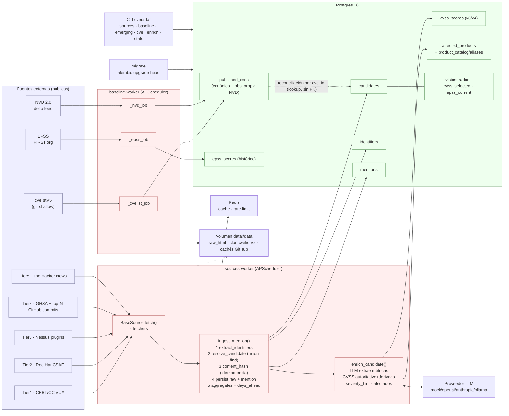

# Arquitectura de CVERadar

CVERadar es un **radar temprano de vulnerabilidades**: un backend de carga de
datos (sin UI) que capta señales de que una vulnerabilidad existe **antes** de
que su CVE esté publicado y analizado en NVD, y mide cuántos días de ventaja
obtiene cada fuente.

Todo el código vive en el paquete `app/` y se ejecuta como procesos Python
sobre Postgres 16 + Redis. No hay servidor web ni frontend.

---

## Diagrama de componentes



Leyenda: **azul** = fuentes externas · **rojo** = procesos/lógica ·
**verde** = almacenamiento. Flechas continuas = flujo de datos; punteadas =
infraestructura de apoyo; la punteada etiquetada = reconciliación blanda por
`cve_id`.

---

## Los tres procesos de `docker-compose.yml`

`docker-compose.yml` levanta infraestructura (`postgres`, `redis`) y tres
procesos de aplicación construidos con la misma imagen (`docker/Dockerfile`):

| Servicio | Comando | Rol |
|---|---|---|
| `migrate` | `alembic upgrade head` | Aplica las migraciones y termina. El resto espera a que acabe con éxito (`service_completed_successfully`). |
| `baseline-worker` | `python -m app.baseline` | Sincroniza el estado canónico (cvelistV5 + delta NVD 2.0 + EPSS) en bucle con APScheduler. |
| `sources-worker` | `python -m app.sources` | Ejecuta los fetchers habilitados en sus cadencias; ingesta menciones y enriquece candidates. |

`migrate` es un job efímero de un solo uso; los dos workers son procesos de
larga duración (`restart: unless-stopped`). Ambos workers y `migrate`
comparten el volumen `data:/data` (HTML crudo, clon de cvelistV5, cachés de
GitHub) y apuntan al mismo `DATABASE_URL`.

- **`app/baseline/__main__.py`** — `AsyncIOScheduler` con tres jobs
  (`_cvelist_job`, `_nvd_job`, `_epss_job`) a las cadencias de `Settings`
  (`cvelist_sync_seconds=900`, `nvd_delta_seconds=7200`,
  `epss_sync_seconds=86400`). Hace una pasada inicial inmediata al arrancar.
- **`app/sources/__main__.py`** — al arrancar llama a `sync_registry_to_db()`
  (registra los fetchers del código en la tabla `sources`) y programa cada
  fuente `enabled` con su `cadence_seconds` (con `jitter=30`,
  `max_instances=1`).

---

## Flujo de datos: fuente → ingesta → candidate → enriquecimiento

```
                 ┌──────────────────── baseline-worker ─────────────────────┐
                 │  cvelistV5 (git shallow)  NVD 2.0 delta   EPSS (FIRST)    │
                 │        │                      │              │            │
                 │        └──────────► published_cves ◄─────────┘            │
                 │            (estado canónico + observación propia NVD)     │
                 └───────────────────────────┬──────────────────────────────┘
                                             │ reconciliación por cve_id (lookup, sin FK)
                                             ▼
 ┌──────────────────── sources-worker ───────────────────────────────────────┐
 │                                                                            │
 │  BaseSource.fetch(ctx) ──► list[FetchedMention]   (Capa 2: captación)      │
 │  certcc_vu · redhat_csaf · nessus · github_advisories · thehackernews ·    │
 │  github_commits                                                            │
 │        │                                                                   │
 │        ▼  ingest_mention()   (app/ingest/service.py)                       │
 │   1. extract_identifiers()  (regex: CVE, ZDI-CAN, VU#, GHSA, GHCOMMIT…)    │
 │   2. resolve_candidate()    (union-find sobre identifiers)                 │
 │   3. content_hash()         (idempotencia por extracto, no por HTML crudo) │
 │   4. persist raw_html + INSERT mention                                     │
 │   5. _refresh_aggregates() + compute_days_ahead()                          │
 │        │                                                                   │
 │        ▼                                                                   │
 │   candidates ◄── identifiers ◄── mentions                                  │
 │        │                                                                   │
 │        ▼  enrich_candidate()  (Capa 3: app/enrichment/service.py)          │
 │   LLM extrae MÉTRICAS ─► cvss_scores (autoritativo + derivado)             │
 │                       ─► affected_products (canonicalización por alias)    │
 └────────────────────────────────────────────────────────────────────────────┘
```

Las **capas** del sistema:

- **Capa 1 — Baseline**: `published_cves`, `epss_scores` (verdad canónica).
- **Capa 2 — Captación e ingesta**: fuentes → `mentions` → `candidates` /
  `identifiers`.
- **Capa 3 — Enriquecimiento**: LLM + CVSS + canonicalización de producto.

---

## El concepto CLAVE: `candidate` desacoplado del CVE

La unidad de rastreo **no es el CVE, es el `candidate`** (tabla `candidates`).
Un candidate puede existir **antes** de que exista un CVE, anclado por un
**identificador nativo** distinto del CVE:

- `ZDI-CAN-nnnnn` — reserva interna de la Zero Day Initiative, previa al CVE.
- `VU#nnnnnn` — nota de CERT/CC.
- `GHCOMMIT:owner/repo@sha` — identificador **sintético** que ancla un fix de
  seguridad sin CVE detectado en commits de GitHub (ver `SOURCES.md`).

Cuando más tarde aparece el CVE (en otra mención, o en el baseline), la
**reconciliación** (`app/ingest/reconcile.py`) fusiona por union-find los
candidates que comparten identificadores, y el campo `candidates.cve_id` se
rellena por *lookup* — **no** por integridad referencial. Por eso `cve_id` es
una **referencia blanda** (la migración `0003_soft_cve_ref.py` elimina el FK a
`published_cves`): un CVE puede estar solo RESERVADO y no ingerido todavía, y
aun así queremos registrar la señal. Ver `DESIGN_DECISIONS.md`.

Ciclo de vida del `status` de un candidate:
`candidate` → `emerging` (≥1 mención) → `published` (el CVE aparece PUBLISHED en
el baseline) — con `merged` para los tombstones de fusión y `rejected` como
estado terminal posible.

---

## Los tres `days_ahead` y por qué `present` es la métrica robusta

Al reconciliar un candidate con su CVE, `compute_days_ahead()`
(`app/ingest/service.py`) calcula tres deltas entre la **primera vez que
CVERadar vio la señal** (`candidate.first_seen_at`) y tres hitos de NVD:

| Columna | Contra qué timestamp de NVD | Naturaleza |
|---|---|---|
| `days_ahead_vs_nvd_published` | `nvd_published_at` | Fecha **auto-reportada** por NVD. Sensible a *backfill*. |
| `days_ahead_vs_nvd_present` | `nvd_first_observed_at` | **Observación propia**: cuándo lo vimos por primera vez en NVD. |
| `days_ahead_vs_nvd_analyzed` | `nvd_first_analyzed_observed_at` | Cuándo lo vimos por primera vez en estado `Analyzed`. |

El problema del *backfill*: NVD puede publicar hoy un CVE con un
`published` fechado en el pasado, o reescribir fechas retroactivamente. Un
delta calculado contra `nvd_published_at` puede quedar distorsionado o incluso
negativo por esos reajustes.

`nvd_first_observed_at` es **ground truth propio**: lo fija el módulo NVD
(`app/baseline/nvd.py`) con `COALESCE(existing, observed_at)` la **primera** vez
que CVERadar ve el CVE en el delta feed, y **nunca se pisa** en observaciones
posteriores. Es inmune al backfill porque mide un hecho de nuestro propio reloj:
"a esta hora, este CVE ya estaba en NVD para nosotros". Por eso
`days_ahead_vs_nvd_present` es la métrica de ventaja robusta, y es la que la CLI
(`emerging`, `stats`) y la vista `radar` muestran por defecto.
