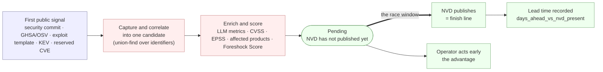
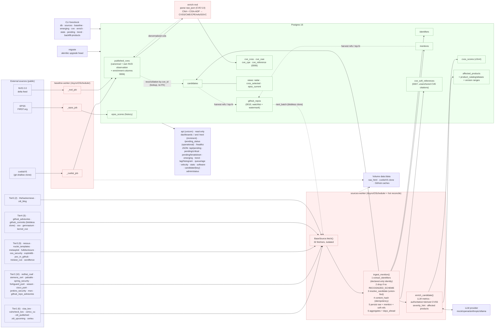

# Foreshock Architecture

Foreshock is an **early vulnerability radar**: a data-ingestion platform that
picks up signals that a vulnerability exists **before** its CVE is published and
analyzed in NVD, and measures how many *lead days* each source gains over NVD.

All code lives in the `app/` package and runs as plain Python processes over
Postgres 16. FastAPI serves a read-only JSON API plus two dashboards: the
official "imminent" dashboard at `/` (and its alias `/next`) and the operational
`/pending_status` dashboard; `/healthz` is the database health check.

> **Framing.** MITRE (cvelistV5) and OSV are the **finish line** — the authoritative,
> canonical record of what a vulnerability *is*. Foreshock does not try to replace them;
> it watches the **race** that happens before they cross that line: the reserved id, the
> exploit template, the security commit, the KEV entry. See
> [*What Foreshock answers that MITRE/OSV cannot*](#what-foreshock-answers-that-mitreosv-cannot).

---

## Conceptual process — the race Foreshock watches

Before the component wiring, the idea in one picture: a public signal appears, Foreshock
captures and correlates it into a **candidate**, enriches and scores it, and it stays
**pending** until NVD crosses the finish line — the gap between the two is the **lead time**
Foreshock measures and the window an operator can act in.



Legend: **blue** = external signal · **red** = Foreshock processing · **green** = outcome
(the pending state, NVD's publication, the recorded lead, and the operator's early action).

---

## Component diagram



Legend: **blue** = external sources · **red** = processes/logic · **green** = storage.
Solid arrows = data flow; dotted = supporting infrastructure; the labeled dotted arrow =
soft reconciliation by `cve_id` (a *lookup*, never a foreign key).

---

## Application processes

`docker-compose.yml` brings up Postgres and four
application processes built from the same image (`docker/Dockerfile`,
`python:3.12-slim`, dependencies installed with `uv`, `git` present for the cvelistV5
clone):

| Service | Command | Role |
|---|---|---|
| `migrate` | `alembic upgrade head` | Applies the migrations and exits. Both workers wait for it via `depends_on: migrate: {condition: service_completed_successfully}`. |
| `baseline-worker` | `python -m app.baseline` | Syncs the canonical state (cvelistV5 + NVD 2.0 delta + EPSS) in a loop. |
| `sources-worker` | `python -m app.sources` | Runs the enabled fetchers on their cadences; ingests mentions and enriches candidates. |
| `api` | `uvicorn app.api.main:app` | Read-only JSON API plus the official "imminent" dashboard at `/` (and `/next`), the operational `/pending_status` dashboard, and the `/healthz` DB check. |

`migrate` is an ephemeral single-use job; the two workers and API are
long-running (`restart: unless-stopped`). The workers share `data:/data` (raw
HTML, cvelistV5 clone, GitHub caches); every process points at the same
`DATABASE_URL`.

### `baseline-worker` (`app/baseline/__main__.py`)
An `AsyncIOScheduler` with three interval jobs at cadences from `Settings`:

| Job | Function | Default cadence (env) |
|---|---|---|
| `cvelist` | `_cvelist_job → sync_cvelist` (git shallow pull, run in a thread) | `FORESHOCK_CVELIST_SYNC_SECONDS=900` (15 min) |
| `nvd` | `_nvd_job → sync_nvd_delta` (NVD 2.0 delta, async) | `FORESHOCK_NVD_DELTA_SECONDS=7200` (2 h) |
| `epss` | `_epss_job → sync_epss` (FIRST.org, async) | `FORESHOCK_EPSS_SYNC_SECONDS=86400` (daily) |

It runs one **immediate** pass on startup, then on interval. Each job wraps its call in
try/except so a failure in one source never brings down the worker or blocks the others.
`run_baseline_once()` (`app/baseline/service.py`) is the synchronous entry point the CLI
reuses.

### `sources-worker` (`app/sources/__main__.py`) — scheduler with hot reconcile
On startup it calls `sync_registry_to_db()` (registers every code-declared fetcher into
the `sources` table) and then schedules each **enabled** source at its
`cadence_seconds` with `jitter=30` and `max_instances=1`. Initial executions are
spread across `FORESHOCK_SOURCES_STARTUP_SPREAD_SECONDS` instead of launching
every fetcher simultaneously.

The distinctive part is `_reconcile_jobs()`, wired as its own interval job
(`id="_reconcile"`, every 60 s):

- **enable/disable live**: sources present in the DB as enabled but missing from the
  scheduler are *added*; jobs whose source is no longer enabled are *removed*.
- **cadence change live**: if `cadence_seconds` changed in the DB, the job is
  *rescheduled* without a restart.

So an operator can `foreshock sources disable thehackernews` or bump a cadence and the
running worker picks it up within a minute — no redeploy. `sync_registry_to_db()`
deliberately **does not** overwrite `cadence_seconds`, so operational tuning survives
code re-syncs.

Each fetch is isolated twice over: `run_source()` catches any exception from
`fetch()` (recording it in `sources.last_error`), and every individual mention is
ingested inside a `session.begin_nested()` savepoint, so one bad mention neither aborts
the batch nor loses the valid ones. The complete fetch/parse/ingest lifecycle is
bounded globally (default 4), heavy sources are serialized (default 1), and Git
sources share a separate process limit (default 1). Git subprocesses run in
their own process group and are always killed and reaped on timeout/cancellation;
Compose also enables a tiny init process as a final orphan-reaping guard.

Both workers publish a 30-second runtime heartbeat in `sync_state`. The
`/pending_status` dashboard uses it to show process/thread/zombie counts, memory,
active/queued jobs and worker liveness without mounting the Docker socket.

---

## Data flow: source → ingestion → candidate → enrichment, layer by layer

```
                 ┌──────────────────── baseline-worker ─────────────────────┐
                 │  cvelistV5 (git shallow)  NVD 2.0 delta   EPSS (FIRST)    │
                 │        │                      │              │            │
                 │        └──────────► published_cves ◄─────────┘  epss_scores
                 │            (canonical state + own NVD observation)        │
                 └───────────────────────────┬──────────────────────────────┘
                                             │ reconciliation by cve_id (lookup, no FK)
                                             ▼
 ┌──────────────────── sources-worker ───────────────────────────────────────┐
 │  BaseSource.fetch(ctx) ──► list[FetchedMention]        (Layer 2: capture)  │
 │  32 fetchers by tier:                                                      │
 │   T1 cisa_kev · vulncheck_kev · certcc_vu · zdi_published · zdi_upcoming · │
 │      certeu                                                                │
 │   T2 redhat_csaf · siemens_cert · paloalto · spring_security ·             │
 │      fortiguard_psirt · veeam · cisco_psirt · jenkins_security · msrc ·    │
 │      github_repo_advisories                                                │
 │   T3 nessus · nuclei_templates · metasploit · fulldisclosure ·             │
 │      oss_security · exploitdb · poc_in_github · trickest_cve · wordfence   │
 │   T4 github_advisories · github_commits (blobless clone) · osv · gemnasium │
 │      · kernel_cve                                                          │
 │   T5 thehackernews · zdi_blog                                              │
 │        │                                                                   │
 │        ▼  ingest_mention()   (app/ingest/service.py)                       │
 │   1. extract_identifiers()  IDENTITY = declared ids only (cve/native/extra)│
 │      schemes: CVE, ZDI-CAN, ZDI, VU#, GHSA, MSRC,                          │
 │              OSV[PYSEC/GO/RUSTSEC/GSD/MAL/OSV]  (GHCOMMIT defined but       │
 │              NOT recognized)                                               │
 │   2. DROP if no RECOGNIZED_SCHEME  (nothing stored without a CVE/code)     │
 │   3. resolve_candidate()    (union-find over identifiers)                  │
 │   4. content_hash()         (idempotency by excerpt, not raw HTML)         │
 │   5. persist raw_html + INSERT mention                                     │
 │   6. _record_soft_references()  (CVEs cited in prose, NOT anchored)        │
 │   7. _refresh_aggregates() + compute_days_ahead()                          │
 │   +  _apply_candidate_updates(): flags (in_kev…), structured CVSS,         │
 │      affected products, cwe_ids, reference_urls, withdrawn                 │
 │        │                                                                   │
 │        ▼                                                                   │
 │   candidates ◄── identifiers ◄── mentions ──► cve_soft_references          │
 │        │                                                                   │
 │        ▼  enrich_candidate()  (Layer 3: app/enrichment/service.py)         │
 │   LLM extracts METRICS ─► cvss_scores (authoritative + derived)            │
 │                       ─► affected_products (canonicalization by alias)     │
 └────────────────────────────────────────────────────────────────────────────┘
```

The system's **three layers**:

- **Layer 1 — Baseline** (`app/baseline/*`): `published_cves`, `epss_scores` — the
  canonical truth, plus Foreshock's own NVD observation timestamps. An idempotent
  **NVD enrichment** pass (`app/baseline/enrich.py`, `foreshock baseline enrich-nvd`)
  derives structured data from `published_cves.raw_json` into `cve_cvss` / `cve_cwe`
  / `cve_cpe` / `cve_reference` plus denormalized columns on `published_cves` (see
  below).
- **Layer 2 — Capture & ingestion** (`app/sources/*`, `app/ingest/*`): fetchers emit
  `FetchedMention` objects; the ingest pipeline turns them into `mentions`,
  `candidates`, `identifiers` idempotently. Structured payloads a fetcher already knows
  (OSV/GHSA CVSS vectors, affected products, CWE ids, reference URLs, `withdrawn`, KEV
  flags) are applied to the candidate **on every ingest of that mention — new or
  duplicate** (`_apply_candidate_updates`), so a re-emission that now carries `in_kev`
  still lands.
- **Layer 3 — Enrichment** (`app/enrichment/*`): the LLM extracts structured metadata
  (not a CVSS number), CVSS is computed on a strict precedence, and product names are
  canonicalized against the catalog.

---

## The KEY concept: `candidate` decoupled from the CVE

The tracking unit **is not the CVE — it is the `candidate`** (`candidates` table). A
candidate can exist **before** any CVE exists, anchored by native identifiers other than
the CVE. `app/ingest/identifiers.py` recognises, in priority order:

| Scheme | Example | Meaning / why it precedes the CVE |
|---|---|---|
| `CVE` | `CVE-2026-1234` | The CVE itself (may still be RESERVED). |
| `ZDI-CAN` | `ZDI-CAN-26123` | ZDI **internal reservation** issued before the CVE. |
| `ZDI` | `ZDI-26-123` | Published ZDI advisory. |
| `VU` | `VU#123456` | CERT/CC vulnerability note. |
| `GHSA` | `GHSA-jfh8-c2jp-5v3q` | GitHub Security Advisory (canonicalized `GHSA-`+lowercase body). |
| `MSRC` | `ADV123456` | Microsoft advisory number. |
| `OSV` | `PYSEC-2026-1`, `GO-2026-1`, `RUSTSEC-2026-0001`, `GSD-2026-1`, `MAL-2026-1`, `OSV-2026-1` | OSV ecosystem advisory ids: PyPI (`PYSEC`), Go (`GO`), Rust (`RUSTSEC`), generic (`GSD`/`OSV`), and **`MAL`** malicious-package advisories — all can predate a CVE. |

`GHCOMMIT:owner/repo@<sha>` is still a **defined** scheme (a synthetic id for a
bare security-fix commit), but it is **no longer stored**. See the recognition
policy below.

### Recognition policy: nothing is stored without a recognized code

`identifiers.py` defines `RECOGNIZED_SCHEMES = {CVE, ZDI-CAN, ZDI, VU, GHSA,
MSRC, OSV}`. A mention that resolves to **no** recognized code is **dropped** —
Foreshock stores nothing that lacks a CVE or an equivalent official code.
`GHCOMMIT` is deliberately **excluded** from `RECOGNIZED_SCHEMES`, and
`github_synthesize_candidates` now defaults to `False`, so a bare security-fix
commit with no CVE is neither synthesized nor anchored. A commit that *does* cite
a real CVE (or a GHSA) still enters through that recognized code. This replaces
the earlier design in which `GHCOMMIT` anchored and stored a standalone pre-CVE
candidate.

### Soft references: counting CVEs cited in prose without merging

A note's prose (a GHSA body, a commit message, a news item) often cites CVEs that
are **not** the note's own anchored CVE. Anchoring or merging on those would
collapse distinct vulnerabilities (over-merge). Instead, `_record_soft_references`
records each such CVE in `cve_soft_references` (migration `0007`): **not**
anchored, **not** merged, **not** in `identifiers` or the union-find — just "this
CVE was mentioned here", so it can be counted and given context (the cited CVE may
not even be published yet). See `INGESTION.md` and `DATA_MODEL.md`.

Each `(scheme, value)` is globally unique (`identifiers.uq_identifiers_scheme_value`) and
points to exactly one candidate. When a mention brings identifiers that already pointed at
*different* candidates, `resolve_candidate()` **merges** them (union-find with a reversible
`merged_into` tombstone; `_pick_winner` prefers the one that has a CVE, then the oldest
`first_seen_at`). When the CVE later appears — in another mention or in the baseline —
`candidates.cve_id` is filled by *lookup*, **not** by referential integrity.

That is exactly why `cve_id` is a **soft reference**: migration `0003_soft_cve_ref.py`
drops the FK to `published_cves`. A CVE may be only RESERVED and not ingested yet, and we
still want the early signal on record. Forcing the FK would reject precisely the data
Foreshock exists to keep.

**Status lifecycle**: `candidate` → `emerging` (`_refresh_aggregates` on the first
mention) → `published` (`compute_days_ahead` when the CVE has **NVD data** —
`published_cves.nvd_published_at IS NOT NULL`, see below). `merged` marks a
union-find tombstone; `rejected` is a possible terminal state.

---

## The three `days_ahead` and why `present` is the robust metric

When a candidate reconciles with its CVE, `compute_days_ahead()`
(`app/ingest/service.py`) computes three deltas between the **first time Foreshock saw the
signal** (`candidate.first_seen_at`) and three NVD milestones (rounded, so small negative
deltas don't floor to −1):

| Column | Against which NVD timestamp | Nature |
|---|---|---|
| `days_ahead_vs_nvd_published` | `nvd_published_at` | Date **self-reported** by NVD. Sensitive to *backfill*. |
| `days_ahead_vs_nvd_present` | `nvd_first_observed_at` | **Own observation**: when we first saw it in NVD. |
| `days_ahead_vs_nvd_analyzed` | `nvd_first_analyzed_observed_at` | When we first saw it in `Analyzed` state. |

**Promotion to `published` means "NVD has data".** `compute_days_ahead` promotes a
candidate to `published` only when `published_cves.nvd_published_at IS NOT NULL` —
i.e. the CVE actually has an NVD publication date. A CVE that is merely RESERVED,
or present in MITRE/cvelist but without an NVD date, stays **pre-published** for us
(that is precisely the early window Foreshock cares about).

**The backfill problem.** NVD can publish a CVE today with a `published` date set in the
past, or rewrite dates retroactively. A delta against `nvd_published_at` can end up
distorted or even negative because of those adjustments.

`nvd_first_observed_at` is **our own ground truth**: `upsert_nvd()` (`app/baseline/nvd.py`)
writes it with `COALESCE(existing, observed_at)` the **first** time Foreshock sees the CVE
in the delta feed and never overwrites it afterwards (`nvd_first_analyzed_observed_at`
works the same way but is sealed only when the observed status is `Analyzed`). It measures
a fact on *our* clock — "at this instant the CVE was already in NVD for us" — so it is
immune to backfill. That is why `days_ahead_vs_nvd_present` is the robust lead metric and
the default in the CLI (`emerging`, `stats`) and the `radar` view.

### Two distinct "operational" scopings — don't conflate them

The read-only API applies **two different** operational floors:

- **The lead / "Ventaja" metric** (`/api/lag/histogram`, `metric=present`, default
  `include_historical=false`) measures lead **only from Foreshock's real operational
  start** — derived *dynamically* at query time from
  `min(published_cves.nvd_first_observed_at)` (the day the baseline first observed
  anything). The `FORESHOCK_OPERATIONAL_START` env var overrides it, and it falls back
  to the fixed `OPERATIONAL_MIN_DATE` (`2026-01-01`) **only** when nothing has been
  observed yet. The response echoes the floor it used in an `operational_start` field.
  `include_historical=true` restores the older rolling-window / all-time behavior (and
  `operational_start` is then `null`). This keeps signals that carry old advisory dates
  (e.g. pre-install GitHub advisories) from counting as spurious pre-installation lead.
- **The `pending` / `trend` operational window** filters use instead the **fixed**
  `OPERATIONAL_MIN_DATE = 2026-01-01` constant (`app/core/operational.py`) — a static
  product-window floor, *not* the dynamically derived operational start above. These are
  two distinct notions.

`/api/velocity` reports the daily count of `candidates.created_at` over the last N days —
Foreshock's own **capture clock** (the real ingestion rhythm, not the advisory date).

---

## NVD structured enrichment (`enrich-nvd`)

`published_cves.raw_json` holds the full **CVE JSON 5.0** record from cvelistV5,
with a CNA container and CISA **ADP ("Vulnrichment")** containers.
`app/baseline/enrich.py` (`foreshock baseline enrich-nvd`) is a **purely derived**,
network-free, idempotent batch (delete-by-cve + insert) that parses that JSON and
materializes:

- **`cve_cvss`** — every CVSS metric (v2/v3.0/3.1/4.0) by source (CNA short name /
  `cisa-adp`), with vector, base/exploitability/impact scores and severity.
- **`cve_cwe`** — declared weaknesses (`CWE-…` or free text).
- **`cve_cpe`** — affected products as CPE 2.3 strings.
- **`cve_reference`** — reference URLs with their tags (Exploit/Patch/…).
- **denormalized columns on `published_cves`** for fast filters/joins:
  `description_en`, `primary_cvss_version/score/severity/vector`, `primary_cwe`,
  `has_exploit_ref`, `has_patch_ref`, and the **SSVC** decision from the CISA ADP
  Vulnrichment container (`ssvc_exploitation`, `ssvc_automatable`,
  `ssvc_technical_impact`), plus `enriched_at`.

`parse_record` is a pure function; `enrich_all` walks `published_cves` by keyset.
The "primary" CVSS is chosen CNA-proprietary > primary type > highest version. See
`ENRICHMENT.md` and `DATA_MODEL.md`.

## GitHub repo watchlist / registry

`github_commits` is driven by the `github_repos` table (migration `0010`,
`app/sources/repo_registry.py`), which unifies all repo-discovery strategies under
one `full_name` primary key (dedup) with a per-repo scan `watermark`. Strategies:
`top_n` (top-N by stars, kept — *additional*, not a replacement), `reference`
(repos cited in advisory reference URLs), `past_cve` (referenced repos whose citing
candidate already has a CVE — higher priority), `criticality` (OpenSSF Criticality
Score CSV, opt-in) and `downloads` (top PyPI packages → their repo, opt-in).
`next_batch` orders unscanned-first, then priority, then stars; `foreshock sources
harvest-repos` (re)populates it. See `SOURCES.md` §3.4.

## What Foreshock answers that MITRE/OSV cannot

MITRE (cvelistV5) and OSV answer *"what is this vulnerability, authoritatively?"* — the
canonical record. They are the goal. Foreshock answers a different, time-shifted question:
*"what is about to become a vulnerability, and how much warning did each signal give?"* —
the **race** before that record exists. Concretely:

### Threat anticipation — exploit *before* CVE
The highest-value cross is **an exploitation artifact for a CVE that is still only
RESERVED (or has no CVE at all)**:

- **`nuclei_templates`** (ProjectDiscovery) and **`metasploit`** (Rapid7) are watched at
  the *commit* level. A new nuclei detection template or metasploit module is a concrete
  exploit/detection capability. When it references a CVE that `published_cves` shows as
  `RESERVED` (or with no NVD date yet), Foreshock has an **exploit before the CVE is
  public**. MITRE/OSV have nothing to say yet.
- **`has_public_poc` / `poc_urls`** on the candidate capture the same idea for
  proof-of-concept links surfaced by any source or the LLM.

### Pre-KEV
`cisa_kev` and `vulncheck_kev` don't merely generate mentions — they set
`in_kev`/`kev_date`/`kev_source` on the candidate (migration `0004`). Because a candidate
can already carry a dozen earlier mentions (a commit, an OSV advisory, a news post),
Foreshock records **how long the signal existed before it entered KEV** — ground truth for
a future "probability of entering KEV in N days" model. Neither MITRE nor OSV tracks
in-the-wild exploitation timelines.

### Emergence velocity
`mention_count`, `source_count`, `first_seen_at`/`last_seen_at` and the `stats` command
measure **how fast and across how many independent sources** a vulnerability is lighting
up — the acceleration of attention, invisible in a static advisory record.

### Multi-signal crosses
Because every signal is anchored to the same candidate regardless of scheme, Foreshock can
answer questions that require *joining across sources and time*, for example:

- reserved CVE **and** a public exploit template — imminent, prioritize now;
- a CVE cited by a watchlisted-repo commit while it is still only RESERVED — pre-CVE
  (`foreshock pending`);
- `MAL-*` malicious-package advisory correlated to an ecosystem you depend on;
- a candidate whose `days_ahead_vs_nvd_present` is large — a source that consistently
  beats NVD, worth trusting earlier.

### Differential questions the CLI answers directly
- *"Which identified, software-associated vulnerabilities have no official public CVE
  yet, and which software has the most pending?"* → `foreshock pending`
  (splits `product` / `distro` / `malware`).
- *"How is the volume of pending vulnerabilities trending month over month?"* →
  `foreshock trend` (by `first_seen_at`, the earliest radar signal).
- *"How many lead days does each source give us over NVD, on average?"* →
  `foreshock stats` (average `days_ahead_vs_nvd_present`, de-duplicated per candidate).

In short: **MITRE/OSV are the finish line; Foreshock watches the race** and timestamps
everyone's position along the way.
