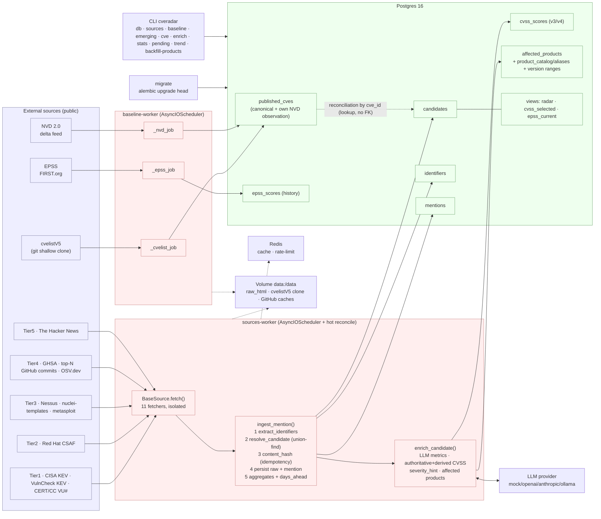

# CVERadar Architecture

CVERadar is an **early vulnerability radar**: a data-ingestion backend (no UI) that
picks up signals that a vulnerability exists **before** its CVE is published and
analyzed in NVD, and measures how many *lead days* each source gains over NVD.

All code lives in the `app/` package and runs as plain Python processes over
Postgres 16 + Redis. There is no web server and no frontend.

> **Framing.** MITRE (cvelistV5) and OSV are the **finish line** — the authoritative,
> canonical record of what a vulnerability *is*. CVERadar does not try to replace them;
> it watches the **race** that happens before they cross that line: the reserved id, the
> exploit template, the security commit, the KEV entry. See
> [*What CVERadar answers that MITRE/OSV cannot*](#what-cveradar-answers-that-mitreosv-cannot).

---

## Component diagram



Legend: **blue** = external sources · **red** = processes/logic · **green** = storage.
Solid arrows = data flow; dotted = supporting infrastructure; the labeled dotted arrow =
soft reconciliation by `cve_id` (a *lookup*, never a foreign key).

---

## The three application processes

`docker-compose.yml` brings up infrastructure (`postgres`, `redis`) and three
application processes built from the same image (`docker/Dockerfile`,
`python:3.12-slim`, dependencies installed with `uv`, `git` present for the cvelistV5
clone):

| Service | Command | Role |
|---|---|---|
| `migrate` | `alembic upgrade head` | Applies the migrations and exits. Both workers wait for it via `depends_on: migrate: {condition: service_completed_successfully}`. |
| `baseline-worker` | `python -m app.baseline` | Syncs the canonical state (cvelistV5 + NVD 2.0 delta + EPSS) in a loop. |
| `sources-worker` | `python -m app.sources` | Runs the enabled fetchers on their cadences; ingests mentions and enriches candidates. |

`migrate` is an ephemeral single-use job; the two workers are long-running
(`restart: unless-stopped`). All three share the `data:/data` volume (raw HTML,
cvelistV5 clone, GitHub caches) and point at the same `DATABASE_URL`.

### `baseline-worker` (`app/baseline/__main__.py`)
An `AsyncIOScheduler` with three interval jobs at cadences from `Settings`:

| Job | Function | Default cadence (env) |
|---|---|---|
| `cvelist` | `_cvelist_job → sync_cvelist` (git shallow pull, run in a thread) | `CVERADAR_CVELIST_SYNC_SECONDS=900` (15 min) |
| `nvd` | `_nvd_job → sync_nvd_delta` (NVD 2.0 delta, async) | `CVERADAR_NVD_DELTA_SECONDS=7200` (2 h) |
| `epss` | `_epss_job → sync_epss` (FIRST.org, async) | `CVERADAR_EPSS_SYNC_SECONDS=86400` (daily) |

It runs one **immediate** pass on startup, then on interval. Each job wraps its call in
try/except so a failure in one source never brings down the worker or blocks the others.
`run_baseline_once()` (`app/baseline/service.py`) is the synchronous entry point the CLI
reuses.

### `sources-worker` (`app/sources/__main__.py`) — scheduler with hot reconcile
On startup it calls `sync_registry_to_db()` (registers every code-declared fetcher into
the `sources` table) and then schedules each **enabled** source at its `cadence_seconds`
with `jitter=30` and `max_instances=1`.

The distinctive part is `_reconcile_jobs()`, wired as its own interval job
(`id="_reconcile"`, every 60 s):

- **enable/disable live**: sources present in the DB as enabled but missing from the
  scheduler are *added*; jobs whose source is no longer enabled are *removed*.
- **cadence change live**: if `cadence_seconds` changed in the DB, the job is
  *rescheduled* without a restart.

So an operator can `cveradar sources disable thehackernews` or bump a cadence and the
running worker picks it up within a minute — no redeploy. `sync_registry_to_db()`
deliberately **does not** overwrite `cadence_seconds`, so operational tuning survives
code re-syncs.

Each fetch is isolated twice over: `run_source()` catches any exception from
`fetch()` (recording it in `sources.last_error`), and every individual mention is
ingested inside a `session.begin_nested()` savepoint, so one bad mention neither aborts
the batch nor loses the valid ones.

---

## Data flow: source → ingestion → candidate → enrichment, layer by layer

```
                 ┌──────────────────── baseline-worker ─────────────────────┐
                 │  cvelistV5 (git shallow)  NVD 2.0 delta   EPSS (FIRST)    │
                 │        │                      │              │            │
                 │        └──────────► published_cves ◄─────────┘  epss_scores
                 │            (canonical state + own NVD observation)        │
                 └───────────────────────────┬──────────────────────────────┘
                                             │ reconciliation by cve_id (lookup, no FK)
                                             ▼
 ┌──────────────────── sources-worker ───────────────────────────────────────┐
 │  BaseSource.fetch(ctx) ──► list[FetchedMention]        (Layer 2: capture)  │
 │  cisa_kev · vulncheck_kev · certcc_vu · redhat_csaf · nessus ·            │
 │  nuclei_templates · metasploit · github_advisories · github_commits ·    │
 │  osv · thehackernews                                                     │
 │        │                                                                   │
 │        ▼  ingest_mention()   (app/ingest/service.py)                       │
 │   1. extract_identifiers()  (CVE, ZDI-CAN, ZDI, VU#, GHSA, MSRC,           │
 │                              GHCOMMIT, OSV[PYSEC/GO/RUSTSEC/GSD/MAL/OSV])   │
 │   2. resolve_candidate()    (union-find over identifiers)                  │
 │   3. content_hash()         (idempotency by excerpt, not raw HTML)         │
 │   4. persist raw_html + INSERT mention                                     │
 │   5. _refresh_aggregates() + compute_days_ahead()                          │
 │   +  _apply_candidate_updates(): flags (in_kev…), structured CVSS,         │
 │      affected products, cwe_ids, reference_urls, withdrawn                 │
 │        │                                                                   │
 │        ▼                                                                   │
 │   candidates ◄── identifiers ◄── mentions                                  │
 │        │                                                                   │
 │        ▼  enrich_candidate()  (Layer 3: app/enrichment/service.py)         │
 │   LLM extracts METRICS ─► cvss_scores (authoritative + derived)            │
 │                       ─► affected_products (canonicalization by alias)     │
 └────────────────────────────────────────────────────────────────────────────┘
```

The system's **three layers**:

- **Layer 1 — Baseline** (`app/baseline/*`): `published_cves`, `epss_scores` — the
  canonical truth, plus CVERadar's own NVD observation timestamps.
- **Layer 2 — Capture & ingestion** (`app/sources/*`, `app/ingest/*`): fetchers emit
  `FetchedMention` objects; the ingest pipeline turns them into `mentions`,
  `candidates`, `identifiers` idempotently. Structured payloads a fetcher already knows
  (OSV/GHSA CVSS vectors, affected products, CWE ids, reference URLs, `withdrawn`, KEV
  flags) are applied to the candidate **on every ingest of that mention — new or
  duplicate** (`_apply_candidate_updates`), so a re-emission that now carries `in_kev`
  still lands.
- **Layer 3 — Enrichment** (`app/enrichment/*`): the LLM extracts structured metadata
  (not a CVSS number), CVSS is computed on a strict precedence, and product names are
  canonicalized against the catalog.

---

## The KEY concept: `candidate` decoupled from the CVE

The tracking unit **is not the CVE — it is the `candidate`** (`candidates` table). A
candidate can exist **before** any CVE exists, anchored by native identifiers other than
the CVE. `app/ingest/identifiers.py` recognises, in priority order:

| Scheme | Example | Meaning / why it precedes the CVE |
|---|---|---|
| `CVE` | `CVE-2026-1234` | The CVE itself (may still be RESERVED). |
| `ZDI-CAN` | `ZDI-CAN-26123` | ZDI **internal reservation** issued before the CVE. |
| `ZDI` | `ZDI-26-123` | Published ZDI advisory. |
| `VU` | `VU#123456` | CERT/CC vulnerability note. |
| `GHSA` | `GHSA-jfh8-c2jp-5v3q` | GitHub Security Advisory (canonicalized `GHSA-`+lowercase body). |
| `MSRC` | `ADV123456` | Microsoft advisory number. |
| `GHCOMMIT` | `GHCOMMIT:owner/repo@<sha>` | **Synthetic** id anchoring a security fix commit that has *no CVE yet* — the purest pre-CVE signal. |
| `OSV` | `PYSEC-2026-1`, `GO-2026-1`, `RUSTSEC-2026-0001`, `GSD-2026-1`, `MAL-2026-1`, `OSV-2026-1` | OSV ecosystem advisory ids: PyPI (`PYSEC`), Go (`GO`), Rust (`RUSTSEC`), generic (`GSD`/`OSV`), and **`MAL`** malicious-package advisories — all can predate a CVE. |

Each `(scheme, value)` is globally unique (`identifiers.uq_identifiers_scheme_value`) and
points to exactly one candidate. When a mention brings identifiers that already pointed at
*different* candidates, `resolve_candidate()` **merges** them (union-find with a reversible
`merged_into` tombstone; `_pick_winner` prefers the one that has a CVE, then the oldest
`first_seen_at`). When the CVE later appears — in another mention or in the baseline —
`candidates.cve_id` is filled by *lookup*, **not** by referential integrity.

That is exactly why `cve_id` is a **soft reference**: migration `0003_soft_cve_ref.py`
drops the FK to `published_cves`. A CVE may be only RESERVED and not ingested yet, and we
still want the early signal on record. Forcing the FK would reject precisely the data
CVERadar exists to keep.

**Status lifecycle**: `candidate` → `emerging` (`_refresh_aggregates` on the first
mention) → `published` (`compute_days_ahead` when the CVE turns up `PUBLISHED` in the
baseline). `merged` marks a union-find tombstone; `rejected` is a possible terminal state.

---

## The three `days_ahead` and why `present` is the robust metric

When a candidate reconciles with its CVE, `compute_days_ahead()`
(`app/ingest/service.py`) computes three deltas between the **first time CVERadar saw the
signal** (`candidate.first_seen_at`) and three NVD milestones (rounded, so small negative
deltas don't floor to −1):

| Column | Against which NVD timestamp | Nature |
|---|---|---|
| `days_ahead_vs_nvd_published` | `nvd_published_at` | Date **self-reported** by NVD. Sensitive to *backfill*. |
| `days_ahead_vs_nvd_present` | `nvd_first_observed_at` | **Own observation**: when we first saw it in NVD. |
| `days_ahead_vs_nvd_analyzed` | `nvd_first_analyzed_observed_at` | When we first saw it in `Analyzed` state. |

**The backfill problem.** NVD can publish a CVE today with a `published` date set in the
past, or rewrite dates retroactively. A delta against `nvd_published_at` can end up
distorted or even negative because of those adjustments.

`nvd_first_observed_at` is **our own ground truth**: `upsert_nvd()` (`app/baseline/nvd.py`)
writes it with `COALESCE(existing, observed_at)` the **first** time CVERadar sees the CVE
in the delta feed and never overwrites it afterwards (`nvd_first_analyzed_observed_at`
works the same way but is sealed only when the observed status is `Analyzed`). It measures
a fact on *our* clock — "at this instant the CVE was already in NVD for us" — so it is
immune to backfill. That is why `days_ahead_vs_nvd_present` is the robust lead metric and
the default in the CLI (`emerging`, `stats`) and the `radar` view.

---

## What CVERadar answers that MITRE/OSV cannot

MITRE (cvelistV5) and OSV answer *"what is this vulnerability, authoritatively?"* — the
canonical record. They are the goal. CVERadar answers a different, time-shifted question:
*"what is about to become a vulnerability, and how much warning did each signal give?"* —
the **race** before that record exists. Concretely:

### Threat anticipation — exploit *before* CVE
The highest-value cross is **an exploitation artifact for a CVE that is still only
RESERVED (or has no CVE at all)**:

- **`nuclei_templates`** (ProjectDiscovery) and **`metasploit`** (Rapid7) are watched at
  the *commit* level. A new nuclei detection template or metasploit module is a concrete
  exploit/detection capability. When it references a CVE that `published_cves` shows as
  `RESERVED` — or a bare `GHCOMMIT`/product with no CVE — CVERadar has an **exploit before
  the CVE is public**. MITRE/OSV have nothing to say yet.
- **`has_public_poc` / `poc_urls`** on the candidate capture the same idea for
  proof-of-concept links surfaced by any source or the LLM.

### Pre-KEV
`cisa_kev` and `vulncheck_kev` don't merely generate mentions — they set
`in_kev`/`kev_date`/`kev_source` on the candidate (migration `0004`). Because a candidate
can already carry a dozen earlier mentions (a commit, an OSV advisory, a news post),
CVERadar records **how long the signal existed before it entered KEV** — ground truth for
a future "probability of entering KEV in N days" model. Neither MITRE nor OSV tracks
in-the-wild exploitation timelines.

### Emergence velocity
`mention_count`, `source_count`, `first_seen_at`/`last_seen_at` and the `stats` command
measure **how fast and across how many independent sources** a vulnerability is lighting
up — the acceleration of attention, invisible in a static advisory record.

### Multi-signal crosses
Because every signal is anchored to the same candidate regardless of scheme, CVERadar can
answer questions that require *joining across sources and time*, for example:

- reserved CVE **and** a public exploit template — imminent, prioritize now;
- security commit in a top-N repo with **no CVE yet** — pre-CVE (`cveradar pending`);
- `MAL-*` malicious-package advisory correlated to an ecosystem you depend on;
- a candidate whose `days_ahead_vs_nvd_present` is large — a source that consistently
  beats NVD, worth trusting earlier.

### Differential questions the CLI answers directly
- *"Which identified, software-associated vulnerabilities have no official public CVE
  yet, and which software has the most pending?"* → `cveradar pending`
  (splits `product` / `distro` / `malware`).
- *"How is the volume of pending vulnerabilities trending month over month?"* →
  `cveradar trend` (by `first_seen_at`, the earliest radar signal).
- *"How many lead days does each source give us over NVD, on average?"* →
  `cveradar stats` (average `days_ahead_vs_nvd_present`, de-duplicated per candidate).

In short: **MITRE/OSV are the finish line; CVERadar watches the race** and timestamps
everyone's position along the way.
