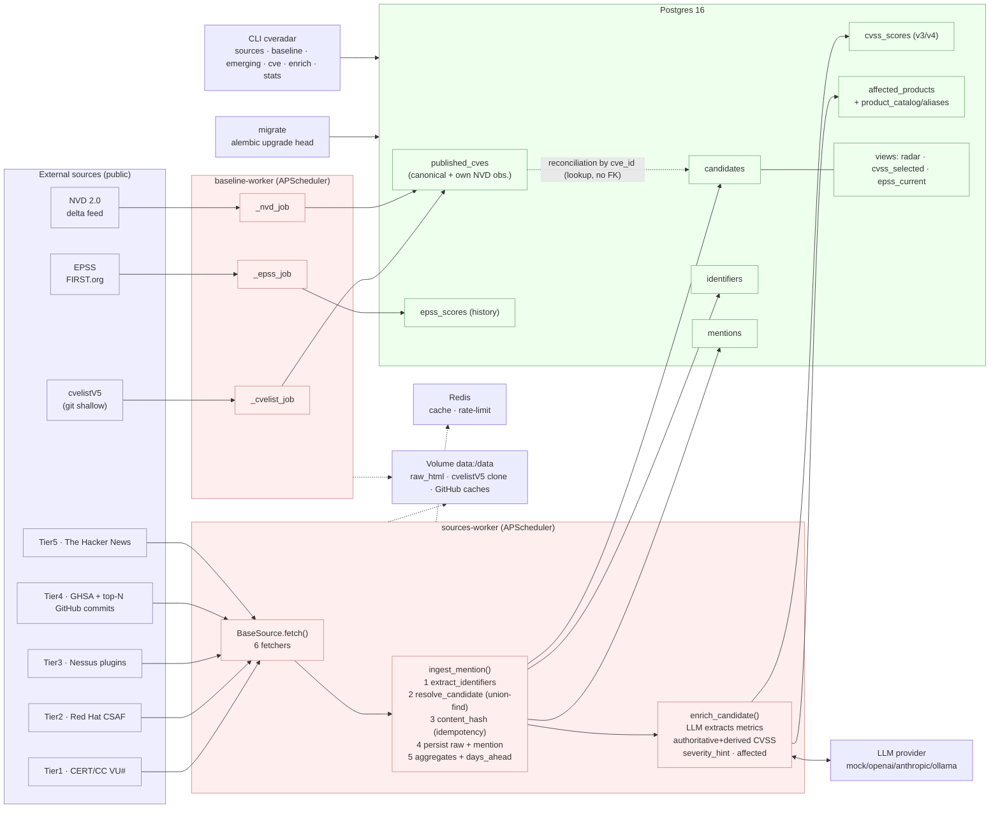

# CVERadar Architecture

CVERadar is an **early vulnerability radar**: a data ingestion backend
(no UI) that picks up signals that a vulnerability exists **before**
its CVE is published and analyzed in NVD, and measures how many lead days
each source gains.

All code lives in the `app/` package and runs as Python processes
over Postgres 16 + Redis. There is no web server and no frontend.

---

## Component diagram



Legend: **blue** = external sources · **red** = processes/logic ·
**green** = storage. Solid arrows = data flow; dotted = supporting
infrastructure; the labeled dotted arrow = soft reconciliation by
`cve_id`.

---

## The three `docker-compose.yml` processes

`docker-compose.yml` brings up infrastructure (`postgres`, `redis`) and three
application processes built from the same image (`docker/Dockerfile`):

| Service | Command | Role |
|---|---|---|
| `migrate` | `alembic upgrade head` | Applies the migrations and exits. Everything else waits for it to finish successfully (`service_completed_successfully`). |
| `baseline-worker` | `python -m app.baseline` | Syncs the canonical state (cvelistV5 + NVD 2.0 delta + EPSS) in a loop with APScheduler. |
| `sources-worker` | `python -m app.sources` | Runs the enabled fetchers on their cadences; ingests mentions and enriches candidates. |

`migrate` is an ephemeral, single-use job; the two workers are long-running
processes (`restart: unless-stopped`). Both workers and `migrate`
share the `data:/data` volume (raw HTML, cvelistV5 clone, GitHub
caches) and point to the same `DATABASE_URL`.

- **`app/baseline/__main__.py`** — `AsyncIOScheduler` with three jobs
  (`_cvelist_job`, `_nvd_job`, `_epss_job`) at the cadences from `Settings`
  (`cvelist_sync_seconds=900`, `nvd_delta_seconds=7200`,
  `epss_sync_seconds=86400`). Runs an immediate first pass on startup.
- **`app/sources/__main__.py`** — on startup it calls `sync_registry_to_db()`
  (registers the code's fetchers in the `sources` table) and schedules each
  `enabled` source at its `cadence_seconds` (with `jitter=30`,
  `max_instances=1`).

---

## Data flow: source → ingestion → candidate → enrichment

```
                 ┌──────────────────── baseline-worker ─────────────────────┐
                 │  cvelistV5 (git shallow)  NVD 2.0 delta   EPSS (FIRST)    │
                 │        │                      │              │            │
                 │        └──────────► published_cves ◄─────────┘            │
                 │            (canonical state + own NVD observation)        │
                 └───────────────────────────┬──────────────────────────────┘
                                             │ reconciliation by cve_id (lookup, no FK)
                                             ▼
 ┌──────────────────── sources-worker ───────────────────────────────────────┐
 │                                                                            │
 │  BaseSource.fetch(ctx) ──► list[FetchedMention]   (Layer 2: capture)       │
 │  certcc_vu · redhat_csaf · nessus · github_advisories · thehackernews ·    │
 │  github_commits                                                            │
 │        │                                                                   │
 │        ▼  ingest_mention()   (app/ingest/service.py)                       │
 │   1. extract_identifiers()  (regex: CVE, ZDI-CAN, VU#, GHSA, GHCOMMIT…)    │
 │   2. resolve_candidate()    (union-find over identifiers)                  │
 │   3. content_hash()         (idempotency by excerpt, not raw HTML)         │
 │   4. persist raw_html + INSERT mention                                     │
 │   5. _refresh_aggregates() + compute_days_ahead()                          │
 │        │                                                                   │
 │        ▼                                                                   │
 │   candidates ◄── identifiers ◄── mentions                                  │
 │        │                                                                   │
 │        ▼  enrich_candidate()  (Layer 3: app/enrichment/service.py)         │
 │   LLM extracts METRICS ─► cvss_scores (authoritative + derived)            │
 │                       ─► affected_products (canonicalization by alias)     │
 └────────────────────────────────────────────────────────────────────────────┘
```

The system's **layers**:

- **Layer 1 — Baseline**: `published_cves`, `epss_scores` (canonical truth).
- **Layer 2 — Capture and ingestion**: sources → `mentions` → `candidates` /
  `identifiers`.
- **Layer 3 — Enrichment**: LLM + CVSS + product canonicalization.

---

## The KEY concept: `candidate` decoupled from the CVE

The tracking unit **is not the CVE, it is the `candidate`** (`candidates` table).
A candidate can exist **before** a CVE exists, anchored by a
**native identifier** other than the CVE:

- `ZDI-CAN-nnnnn` — internal Zero Day Initiative reservation, prior to the CVE.
- `VU#nnnnnn` — CERT/CC note.
- `GHCOMMIT:owner/repo@sha` — **synthetic** identifier that anchors a security
  fix without a detected CVE from GitHub commits (see `SOURCES.md`).

When the CVE later appears (in another mention, or in the baseline), the
**reconciliation** (`app/ingest/reconcile.py`) merges via union-find the
candidates that share identifiers, and the `candidates.cve_id` field is
filled by *lookup* — **not** by referential integrity. That is why `cve_id` is
a **soft reference** (the `0003_soft_cve_ref.py` migration drops the FK to
`published_cves`): a CVE may be only RESERVED and not ingested yet, and
we still want to record the signal. See `DESIGN_DECISIONS.md`.

Lifecycle of a candidate's `status`:
`candidate` → `emerging` (≥1 mention) → `published` (the CVE appears PUBLISHED in
the baseline) — with `merged` for merge tombstones and `rejected` as a possible
terminal state.

---

## The three `days_ahead` and why `present` is the robust metric

When reconciling a candidate with its CVE, `compute_days_ahead()`
(`app/ingest/service.py`) computes three deltas between the **first time
CVERadar saw the signal** (`candidate.first_seen_at`) and three NVD
milestones:

| Column | Against which NVD timestamp | Nature |
|---|---|---|
| `days_ahead_vs_nvd_published` | `nvd_published_at` | Date **self-reported** by NVD. Sensitive to *backfill*. |
| `days_ahead_vs_nvd_present` | `nvd_first_observed_at` | **Own observation**: when we first saw it in NVD. |
| `days_ahead_vs_nvd_analyzed` | `nvd_first_analyzed_observed_at` | When we first saw it in `Analyzed` state. |

The *backfill* problem: NVD may publish a CVE today with a
`published` date set in the past, or rewrite dates retroactively. A
delta computed against `nvd_published_at` may end up distorted or even
negative because of those adjustments.

`nvd_first_observed_at` is **our own ground truth**: it is set by the NVD module
(`app/baseline/nvd.py`) with `COALESCE(existing, observed_at)` the **first** time
CVERadar sees the CVE in the delta feed, and is **never overwritten** in later
observations. It is immune to backfill because it measures a fact from our own clock:
"at this time, this CVE was already in NVD for us". That is why
`days_ahead_vs_nvd_present` is the robust lead metric, and it is the one the CLI
(`emerging`, `stats`) and the `radar` view show by default.
