# Data model

The **hand-written Alembic migrations are the single source of truth for the
schema**:

| Revision | File | What it adds |
|---|---|---|
| `0001_initial` | `migrations/versions/0001_initial_schema.py` | baseline, sources, candidates, identifiers, mentions, candidate_links, cvss_scores, epss_scores + the three views |
| `0002_affected` | `migrations/versions/0002_affected_products.py` | product_catalog, product_aliases, affected_products, affected_version_ranges |
| `0003_soft_cve` | `migrations/versions/0003_soft_cve_ref.py` | drops the FK `candidates.cve_id → published_cves.id` (soft reference) |
| `0004_kev_flags` | `migrations/versions/0004_kev_flags.py` | `candidates.in_kev`, `kev_date`, `kev_source` + partial index |
| `0005_rich_fields` | `migrations/versions/0005_rich_fields.py` | `affected_products.kind`; `candidates.cwe_ids`, `reference_urls`, `withdrawn` |
| `0006_nvd_enrichment` | `migrations/versions/0006_nvd_enrichment.py` | `published_cves` enrichment columns + child tables `cve_cvss`, `cve_cwe`, `cve_cpe`, `cve_reference` |
| `0007_soft_cve_references` | `migrations/versions/0007_soft_cve_references.py` | `cve_soft_references` (CVEs cited in prose, unanchored) |
| `0008_source_method_git` | `migrations/versions/0008_source_method_git.py` | widens `CHECK ck_sources_method` to include `'git'` |
| `0009_source_tier_range` | `migrations/versions/0009_source_tier_range.py` | widens `CHECK ck_sources_tier` to `tier BETWEEN 1 AND 9` |
| `0010_github_repos_registry` | `migrations/versions/0010_github_repos_registry.py` | `github_repos` watchlist/registry (PK `full_name`, per-repo watermark) |

`app/core/models.py` is a SQLModel ORM mapping **over** those tables. `migrations/env.py`
sets `target_metadata=None`, so the models never autogenerate migrations and never
create tables on their own — if you change a migration you must update the model by hand.

Target engine: **Postgres 16**. The schema leans on `gen_random_uuid()`,
`TIMESTAMP WITH TIME ZONE` (`timestamptz`), `JSONB`, `ARRAY(Text)`, partial indexes,
`ON CONFLICT` upserts and PG15+ `NULLS NOT DISTINCT` unique constraints.

---

## Entity-relationship diagram

```mermaid
erDiagram
    published_cves ||..o{ candidates : "soft ref by cve_id (no FK)"
    published_cves ||..o{ epss_scores : "soft ref by cve_id (no FK)"
    sources ||--o{ mentions : "source_id (FK)"
    candidates ||--o{ identifiers : "candidate_id (FK, CASCADE)"
    candidates ||--o{ mentions : "candidate_id (FK, CASCADE)"
    candidates ||--o{ cvss_scores : "candidate_id (FK, CASCADE)"
    candidates ||--o{ affected_products : "candidate_id (FK, CASCADE)"
    candidates ||--o{ candidate_links : "a / b (FK, CASCADE)"
    candidates |o--o{ candidates : "merged_into (self-FK, union-find)"
    product_catalog ||--o{ product_aliases : "catalog_id (FK, CASCADE)"
    product_catalog |o--o{ affected_products : "catalog_id (FK, SET NULL)"
    affected_products ||--o{ affected_version_ranges : "affected_product_id (FK, CASCADE)"
    published_cves ||..o{ cve_cvss : "soft ref by cve_id (no FK)"
    published_cves ||..o{ cve_cwe : "soft ref by cve_id (no FK)"
    published_cves ||..o{ cve_cpe : "soft ref by cve_id (no FK)"
    published_cves ||..o{ cve_reference : "soft ref by cve_id (no FK)"
    published_cves ||..o{ cve_soft_references : "soft ref by cve_id (no FK)"
    mentions ||--o{ cve_soft_references : "mention_id (FK, CASCADE)"
    sources ||--o{ cve_soft_references : "source_id (FK)"
    candidates |o--o{ cve_soft_references : "from_candidate_id (FK, SET NULL)"

    published_cves {
        text id PK "CVE-YYYY-NNNN"
        text state "RESERVED|PUBLISHED|REJECTED"
        timestamptz nvd_published_at "NVD-with-data gate"
        timestamptz nvd_first_observed_at "own ground truth"
        timestamptz nvd_first_analyzed_observed_at
        jsonb raw_json
        text primary_cvss_severity "enrichment (0006)"
        text primary_cwe "enrichment (0006)"
        text ssvc_exploitation "CISA ADP (0006)"
    }
    sources {
        int id PK
        text name UK
        int tier "1..9 (CHECK); 1..5 in use"
        text method "api|rss|scrape|browser|git"
    }
    candidates {
        uuid id PK
        text status "candidate|emerging|published|rejected|merged"
        text cve_id "SOFT ref, no FK"
        uuid merged_into "self-FK"
        int days_ahead_vs_nvd_present
        bool in_kev
    }
    identifiers {
        bigint id PK
        uuid candidate_id FK
        text scheme
        text value
    }
    mentions {
        bigint id PK
        uuid candidate_id FK
        int source_id FK
        text content_hash "UNIQUE(source_id, content_hash)"
    }
    candidate_links {
        uuid a PK
        uuid b PK
        text method "fingerprint|embedding|llm"
        text status "suggested|confirmed|rejected"
    }
    cvss_scores {
        bigint id PK
        uuid candidate_id FK
        text version "3.0|3.1|4.0"
        text provenance "authoritative|derived"
        text source
    }
    epss_scores {
        text cve_id PK
        date scored_date PK
        float score
        float percentile
    }
    product_catalog {
        bigint id PK
        text vendor
        text product
        text ecosystem
    }
    product_aliases {
        bigint id PK
        text alias_normalized UK
        bigint catalog_id FK
    }
    affected_products {
        bigint id PK
        uuid candidate_id FK
        bigint catalog_id FK "nullable"
        text product
        text kind "product|distro|malware"
    }
    affected_version_ranges {
        bigint id PK
        bigint affected_product_id FK
        text introduced
        text fixed
        text last_affected
    }
    cve_cvss {
        bigint id PK
        text cve_id "soft ref, no FK"
        text version "2.0|3.0|3.1|4.0"
        text source "CNA shortName|cisa-adp"
        float base_score
    }
    cve_cwe {
        bigint id PK
        text cve_id "soft ref, no FK"
        text cwe_id
        text source
    }
    cve_cpe {
        bigint id PK
        text cve_id "soft ref, no FK"
        text cpe23
        bool vulnerable
    }
    cve_reference {
        bigint id PK
        text cve_id "soft ref, no FK"
        text url
        text_array tags
    }
    cve_soft_references {
        bigint id PK
        text cve_id "soft ref, no FK"
        bigint mention_id FK
        int source_id FK
        uuid from_candidate_id FK "SET NULL"
    }
    github_repos {
        text full_name PK "owner/repo"
        text origin "top_n|reference|past_cve|criticality|downloads|manual"
        int stars
        int priority
        text watermark "ISO of newest scanned commit"
    }
```

Relationship notes:

- `published_cves → candidates` and `published_cves → epss_scores` are **soft
  references by `cve_id`** — deliberately *not* foreign keys (see below).
- `candidates.merged_into` is a self-FK implementing the union-find tombstone.
- `affected_products.catalog_id` is `ON DELETE SET NULL` (an affected row survives
  catalog deletion, becoming "unresolved"); every other FK below is `ON DELETE CASCADE`.

---

## Layer 1 — Baseline

### `published_cves`
Canonical state of each CVE, fed from cvelistV5 (`app/baseline/cvelist.py`) and the
NVD 2.0 delta feed (`app/baseline/nvd.py`). PK `id` is the CVE string itself.

| Column | Type | Null | Default | Purpose |
|---|---|---|---|---|
| `id` | Text | no | — | Primary key = `CVE-YYYY-NNNN`. |
| `state` | Text | no | — | `RESERVED` / `PUBLISHED` / `REJECTED`. |
| `cvelist_published_at` | timestamptz | yes | — | Publication date **self-reported** by cvelistV5. |
| `cvelist_updated_at` | timestamptz | yes | — | Last-update date self-reported by cvelistV5. |
| `nvd_published_at` | timestamptz | yes | — | Publication date self-reported by NVD (**may arrive back-dated / backfilled**). |
| `nvd_last_modified_at` | timestamptz | yes | — | Last-modified date self-reported by NVD. |
| `nvd_vuln_status` | Text | yes | — | NVD status string, e.g. `Awaiting Analysis`, `Analyzed`. |
| `nvd_first_observed_at` | timestamptz | yes | — | **Own observation ground truth**: the first time *Foreshock* saw this CVE in the NVD delta. Sealed once via `COALESCE`. |
| `nvd_first_analyzed_observed_at` | timestamptz | yes | — | First time we observed this CVE in `Analyzed` state. Sealed once via `COALESCE`, only when the observed status is `Analyzed`. |
| `cna` | Text | yes | — | CNA that owns the record. |
| `assigner_short_name` | Text | yes | — | Assigner short name. |
| `raw_json` | JSONB | yes | — | Original CVE 5.0 record (cvelistV5: CNA + CISA-ADP containers) for later re-parsing. |
| `ingested_at` | timestamptz | no | `now()` | Server-side insert/update timestamp. |
| `description_en` | Text | yes | — | (`0006`) English description from the CNA container. |
| `primary_cvss_version` | Text | yes | — | (`0006`) Version of the chosen primary CVSS (`2.0/3.0/3.1/4.0`). |
| `primary_cvss_score` | Float | yes | — | (`0006`) Base score of the primary CVSS. |
| `primary_cvss_severity` | Text | yes | — | (`0006`) Severity of the primary CVSS (uppercased). |
| `primary_cvss_vector` | Text | yes | — | (`0006`) Vector of the primary CVSS. |
| `primary_cwe` | Text | yes | — | (`0006`) First `CWE-…` weakness. |
| `has_exploit_ref` | Boolean | yes | — | (`0006`) A reference is tagged `Exploit`. |
| `has_patch_ref` | Boolean | yes | — | (`0006`) A reference is tagged `Patch`. |
| `ssvc_exploitation` | Text | yes | — | (`0006`) SSVC `Exploitation` from the CISA ADP "Vulnrichment" container. |
| `ssvc_automatable` | Text | yes | — | (`0006`) SSVC `Automatable` (CISA ADP). |
| `ssvc_technical_impact` | Text | yes | — | (`0006`) SSVC `Technical Impact` (CISA ADP). |
| `enriched_at` | timestamptz | yes | — | (`0006`) When `enrich-nvd` last derived these columns. |

The enrichment columns are **denormalized** shortcuts for filtering/joining; the
full detail lives in the `cve_cvss` / `cve_cwe` / `cve_cpe` / `cve_reference` child
tables. All are populated by `foreshock baseline enrich-nvd` (`app/baseline/enrich.py`),
a purely derived, idempotent batch — see [NVD enrichment tables](#nvd-enrichment-migration-0006)
below and `ENRICHMENT.md`.

**Constraints / indexes**
- `CHECK ck_pubcves_state`: `state IN ('RESERVED','PUBLISHED','REJECTED')`.
- `idx_pubcves_state (state)`, `idx_pubcves_nvd_published (nvd_published_at DESC)`,
  `idx_pubcves_assigner (assigner_short_name)`.
- (`0006`) `idx_pcve_cvss_score (primary_cvss_score)`,
  `idx_pcve_cvss_severity (primary_cvss_severity)`, `idx_pcve_cwe (primary_cwe)`,
  `idx_pcve_ssvc_expl (ssvc_exploitation)`.

**Why the `nvd_first_*` columns exist.** NVD frequently *backfills*: a CVE can be
published today with `nvd_published_at` set in the past, and dates can be rewritten
retroactively. A lead-time metric computed against `nvd_published_at` is therefore
distortable (even negative). `upsert_nvd()` writes `nvd_first_observed_at =
COALESCE(existing, observed_at)` — it is set exactly once, the first time we see the
CVE, and never overwritten. It measures a fact on *our* clock ("at this instant the
CVE was already in NVD for us"), which is what makes `days_ahead_vs_nvd_present` robust.

### `sources`
Registry row per fetcher, synced from code by `sync_registry_to_db()`.

| Column | Type | Null | Default | Purpose |
|---|---|---|---|---|
| `id` | Integer | no | autoincrement | Primary key, referenced by `mentions.source_id`. |
| `name` | Text | no | — | Unique fetcher name (`== BaseSource.name`). |
| `kind` | Text | no | — | Human-readable description of the origin. |
| `method` | Text | no | — | `api` / `rss` / `scrape` / `browser` / `git`. |
| `tier` | Integer | no | — | Signal priority (1 = strongest/earliest); `CHECK 1..9`, values in use `1..5`. |
| `enabled` | Boolean | no | `true` | Scheduler only runs enabled sources. |
| `cadence_seconds` | Integer | no | — | Interval between runs. **Not overwritten** on re-sync (operator may tune it live). |
| `last_success_at` | timestamptz | yes | — | Last successful run. |
| `last_error` | Text | yes | — | Last error text (truncated to 2000 chars). |
| `last_error_at` | timestamptz | yes | — | When the last error happened. |
| `created_at` | timestamptz | no | `now()` | Row creation time. |

**Constraints / indexes**
- `CHECK ck_sources_method`: `method IN ('api','rss','scrape','browser','git')` (widened in `0008`).
- `CHECK ck_sources_tier`: `tier BETWEEN 1 AND 9` (widened in `0009`).
- `UNIQUE(name)`; partial `idx_sources_enabled (enabled) WHERE enabled`.

---

## Layer 2 — Tracking

### `candidates` — the tracking unit
A candidate exists **with or without a CVE**. PK `id` UUID (`gen_random_uuid()`).

| Column | Type | Null | Default | Purpose |
|---|---|---|---|---|
| `id` | UUID | no | `gen_random_uuid()` | Primary key. |
| `status` | Text | no | `'candidate'` | Lifecycle state (see CHECK below). |
| `cve_id` | Text | yes | — | **SOFT reference** to `published_cves.id` — no FK since `0003`. |
| `merged_into` | UUID | yes | — | Self-FK to the winner candidate (union-find tombstone). |
| `cluster_fingerprint` | Text | yes | — | Fingerprint for fuzzy clustering / dedup. |
| `first_seen_at` | timestamptz | no | `now()` | Earliest mention time (recomputed as `min(mentions.seen_at)`). Basis for `days_ahead`. |
| `last_seen_at` | timestamptz | no | `now()` | Latest mention time (`max(mentions.seen_at)`). |
| `mention_count` | Integer | no | `0` | Total mentions (recomputed). |
| `source_count` | Integer | no | `0` | Distinct sources (recomputed). |
| `promoted_at` | timestamptz | yes | — | When status became `published`. |
| `days_ahead_vs_nvd_published` | Integer | yes | — | Lead days vs `nvd_published_at` (backfill-sensitive). |
| `days_ahead_vs_nvd_present` | Integer | yes | — | Lead days vs `nvd_first_observed_at` (**robust, default metric**). |
| `days_ahead_vs_nvd_analyzed` | Integer | yes | — | Lead days vs `nvd_first_analyzed_observed_at`. |
| `affected_product` | Text | yes | — | Enrichment summary: first affected product (`vendor/product`). |
| `affected_versions` | Text | yes | — | Enrichment summary: raw version string. |
| `vuln_type` | Text | yes | — | LLM: RCE / SQLi / XSS / AuthBypass / … |
| `attack_vector` | Text | yes | — | LLM: `network`/`adjacent`/`local`/`physical`. |
| `requires_auth` | Boolean | yes | — | LLM inference. |
| `requires_interaction` | Boolean | yes | — | LLM inference. |
| `has_public_poc` | Boolean | yes | — | LLM inference / source flag. |
| `poc_urls` | ARRAY(Text) | yes | — | LLM-extracted PoC links. |
| `cwe_ids` | ARRAY(Text) | yes | — | (`0005`) CWE ids carried from OSV/GHSA. |
| `reference_urls` | ARRAY(Text) | yes | — | (`0005`) Reference/fix/PoC links (capped at 50 on ingest). |
| `withdrawn` | Boolean | yes | — | (`0005`) Advisory withdrawn (OSV/GHSA). |
| `severity_hint` | Text | yes | — | Qualitative severity when no numeric CVSS exists. |
| `in_kev` | Boolean | yes | — | (`0004`) Present in a KEV catalog (exploited in the wild). |
| `kev_date` | Date | yes | — | (`0004`) KEV `dateAdded`. |
| `kev_source` | Text | yes | — | (`0004`) `'cisa'` or `'vulncheck'`. |
| `enrichment_confidence` | Float | yes | — | LLM confidence `0..1`. |
| `enrichment_method` | Text | yes | — | Which LLM path produced the enrichment. |
| `enrichment_updated_at` | timestamptz | yes | — | Last enrichment time (drives re-enrich policy). |
| `created_at` | timestamptz | no | `now()` | Row creation. |

**Constraints**
- `CHECK ck_cand_status`: `status IN ('candidate','emerging','published','rejected','merged')`.
- `CHECK ck_cand_attack_vector`: `attack_vector IN ('network','adjacent','local','physical') OR NULL`.
- `CHECK ck_cand_severity_hint`: `severity_hint IN ('likely-critical','likely-high','likely-medium','likely-low') OR NULL`.
- `CHECK ck_cand_enrichment_conf`: `enrichment_confidence BETWEEN 0 AND 1 OR NULL`.

**Indexes**: `idx_cand_status`, `idx_cand_cve`, `idx_cand_last_seen (last_seen_at DESC)`,
`idx_cand_fingerprint`, partial `idx_cand_merged_into WHERE merged_into IS NOT NULL`,
partial `idx_cand_in_kev (in_kev) WHERE in_kev`.

**Why `cve_id` is a soft reference (no FK).** Migration `0003` drops
`candidates_cve_id_fkey`. A candidate routinely references a CVE that is only
**RESERVED** and not yet ingested into `published_cves` (or that MITRE/NVD have not
published at all). Enforcing the FK would *reject the early signal* — the exact thing
Foreshock exists to capture. Reconciliation is done by *lookup*
(`compute_days_ahead()` calls `session.get(PublishedCVE, cve_id)`), not by referential
integrity. The `idx_cand_cve` index keeps that lookup cheap.

**Status lifecycle**: `candidate` → `emerging` (`_refresh_aggregates` promotes on the
first mention) → `published` (`compute_days_ahead` promotes when the CVE has **NVD
data**: `published_cves.nvd_published_at IS NOT NULL` — a RESERVED CVE or one without
an NVD date stays pre-published). `merged` is the union-find tombstone; `rejected` is
a possible terminal state.

### `identifiers` — deterministic anchor
Every `(scheme, value)` belongs to exactly one candidate; this is Stage A of the
correlation (deterministic link).

| Column | Type | Null | Default | Purpose |
|---|---|---|---|---|
| `id` | BigInteger | no | autoincrement | Primary key. |
| `candidate_id` | UUID | no | — | FK → `candidates.id` `ON DELETE CASCADE`. |
| `scheme` | Text | no | — | Identifier scheme (see table). |
| `value` | Text | no | — | Canonicalized value. |
| `first_seen_at` | timestamptz | no | `now()` | First time this id was observed. |

**Constraints / indexes**: `UNIQUE(scheme, value)` (`uq_identifiers_scheme_value`) —
the key that makes a native id point to a single candidate and enables the merge;
`idx_ident_candidate (candidate_id)`.

**Identifier schemes** (regexes and canonicalization in `app/ingest/identifiers.py`):

| Scheme | Example | Canonicalization | Meaning |
|---|---|---|---|
| `CVE` | `CVE-2026-1234` | uppercased | The CVE itself. |
| `ZDI-CAN` | `ZDI-CAN-26123` | uppercased | ZDI internal reservation, **pre-CVE**. |
| `ZDI` | `ZDI-26-123` | uppercased | Published ZDI advisory. |
| `VU` | `VU#123456` | uppercased | CERT/CC vulnerability note. |
| `GHSA` | `GHSA-jfh8-c2jp-5v3q` | `GHSA-` + lowercase body | GitHub Security Advisory. |
| `MSRC` | `ADV123456` | uppercased | Microsoft advisory number. |
| `GHCOMMIT` | `GHCOMMIT:owner/repo@<sha7-40>` | preserved (case-sensitive) | **Defined but NOT recognized** — a synthetic id for a bare security-fix commit. It is **not** in `RECOGNIZED_SCHEMES`, so a mention anchored only by `GHCOMMIT` is **dropped** at ingest and never stored. |
| `OSV` | `PYSEC-2026-1`, `GO-2026-1`, `RUSTSEC-2026-0001`, `GSD-2026-1`, `MAL-2026-1`, `OSV-2026-1` | uppercased | OSV ecosystem advisory ids (PyPI/Go/Rust/malware/generic) that anchor advisories that may predate a CVE. |

The list order is the "native" priority: `primary_native()` returns the first
non-CVE id, used to label a mention when no CVE is present.

**Recognition policy.** `RECOGNIZED_SCHEMES = {CVE, ZDI-CAN, ZDI, VU, GHSA, MSRC,
OSV}`. Ingestion **drops** any mention that does not anchor to at least one
recognized scheme — nothing is stored without a CVE or an equivalent official code.
`GHCOMMIT` is intentionally excluded, so no `GHCOMMIT` rows exist in `identifiers`
anymore (this is why the old `backfill-products` `GHCOMMIT` heuristic no longer
matches). See `INGESTION.md` §2.

### `mentions` — raw observations
One row per appearance of a vulnerability in a source (a mention may carry no CVE).

| Column | Type | Null | Default | Purpose |
|---|---|---|---|---|
| `id` | BigInteger | no | autoincrement | Primary key. |
| `candidate_id` | UUID | no | — | FK → `candidates.id` CASCADE. |
| `source_id` | Integer | no | — | FK → `sources.id`. |
| `extracted_cve` | Text | yes | — | CVE parsed from the mention (if any). |
| `extracted_native` | Text | yes | — | Preferred native id (if any). |
| `url` | Text | yes | — | Source URL. |
| `title` | Text | yes | — | Title. |
| `snippet` | Text | yes | — | Short excerpt. |
| `raw_html_path` | Text | yes | — | On-disk path to persisted raw HTML (`{raw_html_dir}/{source_id}/{hash}.html`). |
| `seen_at` | timestamptz | no | `now()` | Observation time (normalized to UTC-aware). |
| `content_hash` | Text | no | — | SHA-256 of the semantic excerpt (idempotency key). |

**Constraints / indexes**: `UNIQUE(source_id, content_hash)` (`uq_mentions_source_hash`);
`idx_mentions_candidate`, `idx_mentions_seen (seen_at DESC)`, `idx_mentions_source`.

**Why the hash is over the excerpt, not the raw HTML.** `content_hash()`
(`app/ingest/hashing.py`) hashes the normalized excerpt = `upper(cve)` + `upper(native)`
+ normalized `title` + normalized `snippet` + `canonical_url(url)`. Raw HTML changes
every fetch (timestamps, ads, CSRF tokens) and would spuriously create new rows.
Hashing the excerpt means an identical re-listing → same hash → no duplicate, while a
real content change → new hash → a legitimately new timeline entry. The CVE identity
lives **inside** the hash, which is why the UNIQUE constraint does **not** include
`cve_id`. `canonical_url()` drops the fragment, strips tracking params (`utm_*`, `mc_*`,
`fbclid`, `gclid`, `ref`, `source`, `mkt_tok`), lowercases host, trims trailing slash
and sorts the query.

### `candidate_links` — proposed fuzzy links (non-destructive)
Suggested associations between candidates that are **not** merged.

| Column | Type | Null | Default | Purpose |
|---|---|---|---|---|
| `a` | UUID | no | — | FK → `candidates.id` CASCADE. Part of composite PK. |
| `b` | UUID | no | — | FK → `candidates.id` CASCADE. Part of composite PK. |
| `method` | Text | no | — | `fingerprint` / `embedding` / `llm`. |
| `confidence` | Float | no | — | `0..1`. |
| `status` | Text | no | `'suggested'` | `suggested` / `confirmed` / `rejected`. |
| `rationale` | Text | yes | — | Audit note. |
| `created_at` | timestamptz | no | `now()` | Row creation. |

**Constraints / indexes**: PK `(a, b)` (`pk_candidate_links`); `CHECK ck_links_canonical_pair`
`a < b` (canonical ordering avoids the mirror pair); `CHECK ck_links_method`,
`CHECK ck_links_confidence` (`0..1`), `CHECK ck_links_status`; partial
`idx_links_status WHERE status = 'suggested'`.

This is deliberately non-destructive: the `identifiers` union-find *actually* merges on
hard deterministic evidence, whereas a `candidate_links` row is only a reviewable
suggestion. Merges do **not** rewrite these rows (their `a < b` UNIQUE would collide);
tombstoned links are cleaned up later.

### `cvss_scores` — v3/v4, authoritative vs derived, multi-source
Several rows per candidate.

| Column | Type | Null | Default | Purpose |
|---|---|---|---|---|
| `id` | BigInteger | no | autoincrement | Primary key. |
| `candidate_id` | UUID | no | — | FK → `candidates.id` CASCADE. |
| `version` | Text | no | — | `3.0` / `3.1` / `4.0`. |
| `vector` | Text | no | — | CVSS vector (verbatim or constructed), uppercased. |
| `base_score` | Float | yes | — | `0..10`. |
| `base_severity` | Text | yes | — | `NONE/LOW/MEDIUM/HIGH/CRITICAL`. |
| `provenance` | Text | no | — | `authoritative` / `derived`. |
| `source` | Text | no | — | Origin tag (`source-text`, `llm-derived`, `osv`, …). |
| `inferred_metrics` | ARRAY(Text) | yes | — | Metrics that came from LLM inference (derived only). |
| `confidence` | Float | yes | — | `0..1` (derived rows). |
| `recorded_at` | timestamptz | no | `now()` | When this score was written. |

**Constraints / indexes**
- `UNIQUE(candidate_id, version, provenance, source)` (`uq_cvss_candidate_version_prov_source`)
  — the upsert key; lets a candidate hold, e.g., an authoritative v3.1 from Red Hat and a
  derived v3.1 from the LLM simultaneously.
- `CHECK ck_cvss_version` (`3.0/3.1/4.0`), `CHECK ck_cvss_base_score` (`0..10 OR NULL`),
  `CHECK ck_cvss_base_severity`, `CHECK ck_cvss_provenance`, `CHECK ck_cvss_confidence`.
- `idx_cvss_candidate (candidate_id)`.

**Authoritative vs derived.** `authoritative` rows come from a real CVSS vector found
verbatim in source text (Red Hat, MSRC, CNA…) or from structured feeds (OSV
`persist_cvss_vectors`, `source='osv'`), scored with the `cvss` library. `derived` rows
are built from the 8 base metrics the LLM inferred, only when **all 8** are present
(`derive_from_metrics`); otherwise no numeric score is written and a `severity_hint`
is used instead. Foreshock never invents a number.

### `epss_scores` — history
FIRST.org exploit-prediction scores, kept as a full time series.

| Column | Type | Null | Default | Purpose |
|---|---|---|---|---|
| `cve_id` | Text | no | — | CVE (part of composite PK). |
| `score` | Float | no | — | EPSS probability `0..1`. |
| `percentile` | Float | no | — | EPSS percentile `0..1`. |
| `model_version` | Text | yes | — | EPSS model version. |
| `scored_date` | Date | no | — | Model date (part of composite PK). |
| `fetched_at` | timestamptz | no | `now()` | Fetch time. |

**Constraints / indexes**: PK `(cve_id, scored_date)` (`pk_epss_scores`) → every daily
snapshot is preserved, so the score's evolution is queryable; `CHECK ck_epss_score`,
`CHECK ck_epss_percentile` (both `0..1`); `idx_epss_cve`, `idx_epss_date (scored_date DESC)`.
**No FK to `published_cves`** — EPSS may reference a CVE not yet ingested.

---

## Software canonicalization (migration `0002`)

### `product_catalog`
Canonical vocabulary (seeded from CPE dictionary / OSV / manual) — the "truth" dirty
names resolve against.

| Column | Type | Null | Default | Purpose |
|---|---|---|---|---|
| `id` | BigInteger | no | autoincrement | Primary key. |
| `vendor` | Text | yes | — | Vendor. |
| `product` | Text | no | — | Product name. |
| `ecosystem` | Text | yes | — | OSV ecosystem (PyPI/npm/Go…); NULL for classic software. |
| `cpe23` | Text | yes | — | CPE 2.3 string. |
| `purl` | Text | yes | — | Package URL. |
| `source` | Text | yes | — | `cpe-dict` / `osv` / `manual`. |
| `created_at` | timestamptz | no | `now()` | Row creation. |

**Constraints / indexes**: `UNIQUE(vendor, product, ecosystem)` **`NULLS NOT DISTINCT`**
(`uq_catalog_vendor_product_ecosystem`) — with the default `NULLS DISTINCT`, two rows
whose `ecosystem`/`vendor` are `NULL` would *not* collide (SQL `NULL != NULL`) and would
duplicate; PG16's `NULLS NOT DISTINCT` treats `NULL` as equal so the dedup actually
holds. Indexes `idx_catalog_product`, `idx_catalog_vendor`, partial
`idx_catalog_cpe23 WHERE cpe23 IS NOT NULL`.

### `product_aliases`
Normalized alias key → one canonical catalog entry.

| Column | Type | Null | Default | Purpose |
|---|---|---|---|---|
| `id` | BigInteger | no | autoincrement | Primary key. |
| `alias_normalized` | Text | no | — | Lowercased/stripped key (`normalize_key`). |
| `catalog_id` | BigInteger | no | — | FK → `product_catalog.id` CASCADE. |
| `source` | Text | no | — | `seed` / `llm` / `manual`. |
| `confidence` | Float | yes | — | `0..1`. |
| `created_at` | timestamptz | no | `now()` | Row creation. |

**Constraints / indexes**: `UNIQUE(alias_normalized)` (`uq_alias_normalized`) — an alias
resolves **deterministically** to a single entry; `CHECK ck_alias_source`,
`CHECK ck_alias_confidence`; `idx_alias_catalog (catalog_id)`.

The table grows with what the LLM/human confirm; next time the same dirty name appears it
resolves in Layer 1 (`_resolve_alias`) without calling the LLM again.

### `affected_products`
Products affected by a candidate (multi-row). Keeps the extracted raw values **plus** the
canonical link and full traceability of how it was resolved.

| Column | Type | Null | Default | Purpose |
|---|---|---|---|---|
| `id` | BigInteger | no | autoincrement | Primary key. |
| `candidate_id` | UUID | no | — | FK → `candidates.id` CASCADE. |
| `catalog_id` | BigInteger | yes | — | FK → `product_catalog.id` `ON DELETE SET NULL`; NULL = unresolved. |
| `vendor` | Text | yes | — | Extracted vendor. |
| `product` | Text | no | — | Extracted product. |
| `ecosystem` | Text | yes | — | Canonicalized ecosystem (`canonical_ecosystem`). |
| `cpe23` | Text | yes | — | CPE 2.3. |
| `purl` | Text | yes | — | Package URL (from OSV/structured feeds). |
| `default_status` | Text | yes | — | `affected` / `unaffected` / `unknown`. |
| `kind` | Text | yes | — | (`0005`) `product` / `distro` / `malware` (`classify_kind`). |
| `exact_versions` | ARRAY(Text) | yes | — | Enumerated OSV `versions[]`. |
| `raw` | Text | yes | — | Original product string. |
| `normalization_method` | Text | yes | — | `exact` / `alias` / `fuzzy` / `llm` / `unresolved`. |
| `normalization_confidence` | Float | yes | — | `0..1`. |
| `source` | Text | yes | — | Where it came from (`structured`, `llm`, …). |
| `confidence` | Float | yes | — | Extraction confidence `0..1`. |
| `created_at` | timestamptz | no | `now()` | Row creation. |

**Constraints / indexes**
- `UNIQUE(candidate_id, vendor, product, ecosystem)` **`NULLS NOT DISTINCT`**
  (`uq_affected_candidate_product`) — the upsert key; NULL vendor/ecosystem still dedup.
- `CHECK ck_affected_status`, `CHECK ck_affected_norm_method`, `CHECK ck_affected_norm_conf`,
  `CHECK ck_affected_conf`.
- `idx_affected_candidate`, `idx_affected_catalog`, partial
  `idx_affected_unresolved (id) WHERE catalog_id IS NULL` (queue of items pending
  resolution); `idx_affected_kind` and `idx_affected_product_name` (added in `0005`).

### `affected_version_ranges`
Structured version ranges per affected product, OSV / CVE-5.0 style.

| Column | Type | Null | Default | Purpose |
|---|---|---|---|---|
| `id` | BigInteger | no | autoincrement | Primary key. |
| `affected_product_id` | BigInteger | no | — | FK → `affected_products.id` CASCADE. |
| `introduced` | Text | yes | — | `0` or first affected version. |
| `fixed` | Text | yes | — | Fixed version (exclusive). |
| `last_affected` | Text | yes | — | Last affected version (inclusive). |
| `version_type` | Text | yes | — | `semver` / `custom` / `rpm` / … |
| `raw` | Text | yes | — | Original range string, e.g. `< 7.4.3`. |

**Index**: `idx_ranges_affected_product (affected_product_id)`. `persist_affected()`
replaces a product's ranges wholesale on upsert (delete-then-insert) to stay idempotent.

---

## NVD enrichment (migration `0006`)

Four **normalized child tables** derived from `published_cves.raw_json` (CVE JSON
5.0). `cve_id` is a **soft reference** to `published_cves.id` (no FK: a CVE can be
enriched from an ADP container before its baseline row exists). `enrich_all`
(`app/baseline/enrich.py`, `foreshock baseline enrich-nvd`) is idempotent via
**delete-by-cve + insert**. See `ENRICHMENT.md`.

### `cve_cvss`
Every CVSS metric found across the CNA and ADP containers (multi-row per CVE).

| Column | Type | Null | Default | Purpose |
|---|---|---|---|---|
| `id` | BigInteger | no | autoincrement | Primary key. |
| `cve_id` | Text | no | — | Soft ref to `published_cves.id`. |
| `version` | Text | no | — | `2.0` / `3.0` / `3.1` / `4.0`. |
| `source` | Text | no | — | CNA `shortName`, or `cisa-adp`. |
| `type` | Text | yes | — | `Primary` / `Secondary` (from the metric). |
| `vector` | Text | yes | — | CVSS vector string. |
| `base_score` | Float | yes | — | Base score. |
| `base_severity` | Text | yes | — | Severity (uppercased). |
| `exploitability_score` | Float | yes | — | Sub-score. |
| `impact_score` | Float | yes | — | Sub-score. |
| `recorded_at` | timestamptz | no | `now()` | Insert time. |

**Indexes**: `idx_cve_cvss_cve (cve_id)`, `idx_cve_cvss_score (base_score)`.

### `cve_cwe`
Declared weaknesses (multi-row per CVE).

| Column | Type | Null | Default | Purpose |
|---|---|---|---|---|
| `id` | BigInteger | no | autoincrement | Primary key. |
| `cve_id` | Text | no | — | Soft ref. |
| `cwe_id` | Text | no | — | `CWE-79` or free-text description when no id. |
| `description` | Text | yes | — | Weakness text (when a `cweId` was present). |
| `source` | Text | yes | — | Container source. |
| `recorded_at` | timestamptz | no | `now()` | Insert time. |

**Indexes**: `idx_cve_cwe_cve (cve_id)`, `idx_cve_cwe_cwe (cwe_id)`.

### `cve_cpe`
Affected products as CPE 2.3 strings (multi-row per CVE).

| Column | Type | Null | Default | Purpose |
|---|---|---|---|---|
| `id` | BigInteger | no | autoincrement | Primary key. |
| `cve_id` | Text | no | — | Soft ref. |
| `cpe23` | Text | no | — | CPE 2.3 string. |
| `vulnerable` | Boolean | yes | — | `False` when the container `defaultStatus` is `unaffected`. |
| `version_start` / `version_start_type` | Text | yes | — | (reserved; currently NULL). |
| `version_end` / `version_end_type` | Text | yes | — | (reserved; currently NULL). |
| `source` | Text | yes | — | Container source. |
| `recorded_at` | timestamptz | no | `now()` | Insert time. |

**Indexes**: `idx_cve_cpe_cve (cve_id)`, `idx_cve_cpe_cpe (cpe23)`.

### `cve_reference`
Reference URLs with their tags (multi-row per CVE; deduped by URL across containers).

| Column | Type | Null | Default | Purpose |
|---|---|---|---|---|
| `id` | BigInteger | no | autoincrement | Primary key. |
| `cve_id` | Text | no | — | Soft ref. |
| `url` | Text | no | — | Reference URL. |
| `tags` | ARRAY(Text) | yes | — | e.g. `Exploit`, `Patch`, `Vendor Advisory`. |
| `source` | Text | yes | — | Container source. |
| `recorded_at` | timestamptz | no | `now()` | Insert time. |

**Indexes**: `idx_cve_ref_cve (cve_id)`, GIN `idx_cve_ref_tags (tags)`.

---

## Soft CVE references (migration `0007`)

### `cve_soft_references`
A CVE **cited in a note's prose** (a GHSA body, commit message, news item) that is
**not** the note's own anchored CVE. Deliberately decoupled from identity: it does
**not** anchor, does **not** merge, and is **not** in `identifiers` or the
union-find. It exists to *count and contextualize* CVEs (often not yet published)
that appear somewhere, without collapsing distinct vulnerabilities. Populated by
`_record_soft_references` in `app/ingest/service.py`.

| Column | Type | Null | Default | Purpose |
|---|---|---|---|---|
| `id` | BigInteger | no | autoincrement | Primary key. |
| `cve_id` | Text | no | — | The cited CVE (**soft ref**, no FK — may be unpublished). |
| `mention_id` | BigInteger | no | — | FK → `mentions.id` `ON DELETE CASCADE`. |
| `source_id` | Integer | no | — | FK → `sources.id`. |
| `from_candidate_id` | UUID | yes | — | FK → `candidates.id` `ON DELETE SET NULL` — the note's candidate (drill-down context). |
| `context` | Text | yes | — | Snippet/title of the note (≤500 chars). |
| `seen_at` | timestamptz | no | `now()` | Insert time. |

**Constraints / indexes**: `UNIQUE(mention_id, cve_id)` (`uq_soft_ref_mention_cve`,
the idempotency key); `idx_soft_ref_cve (cve_id)`, `idx_soft_ref_source (source_id)`.

---

## GitHub repo registry (migration `0010`)

### `github_repos`
Unified watchlist of GitHub repositories scanned by `github_commits`
(`app/sources/repo_registry.py`). PK `full_name` de-dups a repo added by several
discovery strategies; the `watermark` makes each scan incremental (no repo is
re-scanned or duplicated). Replaces the old JSON state files.

| Column | Type | Null | Default | Purpose |
|---|---|---|---|---|
| `full_name` | Text | no | — | Primary key = `owner/repo`. |
| `origin` | Text | no | — | `top_n` / `reference` / `past_cve` / `criticality` / `downloads` / `manual`. |
| `stars` | Integer | yes | — | Star count (from the Search API / top-N). |
| `priority` | Integer | no | `0` | Scan priority (raised to `GREATEST` on conflict). |
| `watermark` | Text | yes | — | ISO of the newest committer date already scanned. |
| `first_seen_at` | timestamptz | no | `now()` | Row creation. |
| `last_scanned_at` | timestamptz | yes | — | Last scan time (NULL = never scanned → scanned first). |

**Indexes**: `idx_ghrepos_scan (last_scanned_at, priority, stars)` (the scan
ordering: unscanned first, then priority, then stars), `idx_ghrepos_origin (origin)`.
**No FK** — the registry is independent of the tracking tables (though it is
*populated* from `mentions` / `cve_reference` / `candidates.reference_urls`).

---

## Convenience views (defined in `0001_initial_schema.py`)

- **`epss_current`** — `SELECT DISTINCT ON (cve_id) … ORDER BY cve_id, scored_date DESC`:
  the latest EPSS snapshot per CVE from the full history.
- **`cvss_selected`** — `SELECT DISTINCT ON (candidate_id) …` with the precedence
  `ORDER BY candidate_id, (provenance = 'authoritative') DESC,
  CASE version WHEN '4.0' THEN 3 WHEN '3.1' THEN 2 ELSE 1 END DESC,
  base_score DESC NULLS LAST`: picks the single "best" CVSS per candidate —
  authoritative beats derived, then newer version wins, then higher score.
- **`radar`** — the main consumption view: `candidates c LEFT JOIN cvss_selected cs ON
  cs.candidate_id = c.id LEFT JOIN epss_current e ON e.cve_id = c.cve_id`, filtered to
  `status IN ('candidate','emerging','published') AND merged_into IS NULL`. It exposes the
  identity/aggregate columns, `days_ahead_vs_nvd_present` and `days_ahead_vs_nvd_analyzed`,
  the selected CVSS (`version`, `base_score`, `base_severity`, `provenance`),
  `severity_hint`, and the current EPSS (`score`, `percentile`).
